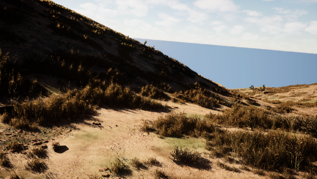
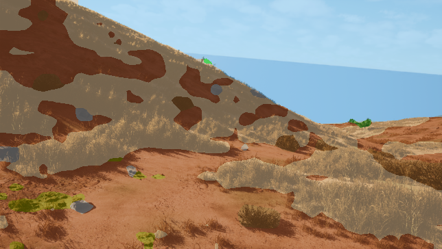
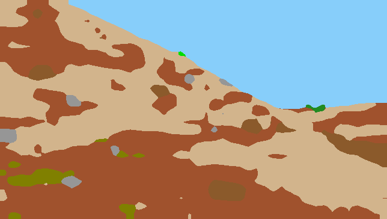

# Result #0001

| Field | Value |
|---|---|
| **Timestamp** | 2026-03-10 10:26:25 |
| **Source** | Random Sample — Sky |
| **Image** | `cc0000823.png` |
| **Model** | Phase 5 — DINOv2 ViT-Base + UPerNet (IoU 0.5294, TTA 0.5310) |
| **Device** | cuda |
| **TTA** | ✅ HFlip average |

## Visualisations

| 📷 Original | 🎨 Segmentation Overlay | 🗺️ Prediction Mask |
|---|---|---|
|  |  |  |

## Overall Metrics (vs Ground Truth)

| Metric | Value |
|---|---|
| **Mean IoU** | 0.4604 |
| **Pixel Accuracy** | 0.8360 (83.60%) |

## Per-Class Breakdown

| Class | IoU | Dice | Pred Pixels | GT Pixels |
|---|---|---|---|---|
| **Background** | N/A (absent) | 1.0000 | 0 | 0 |
| **Trees** | 0.3838 | 0.5547 | 230 | 145 |
| **Lush Bushes** | 0.0074 | 0.0147 | 62 | 74 |
| **Dry Grass** | 0.6582 | 0.7939 | 77,939 | 72,285 |
| **Dry Bushes** | 0.4349 | 0.6061 | 7,143 | 5,745 |
| **Ground Clutter** | 0.1927 | 0.3232 | 3,387 | 4,262 |
| **Logs** | N/A (absent) | 1.0000 | 0 | 0 |
| **Rocks** | 0.3441 | 0.5120 | 2,037 | 2,494 |
| **Landscape** | 0.6735 | 0.8049 | 80,308 | 86,062 |
| **Sky** | 0.9889 | 0.9944 | 63,310 | 63,349 |

---
*Auto-generated by TESTING_INTERFACE/app.py — Offroad Segmentation Project*