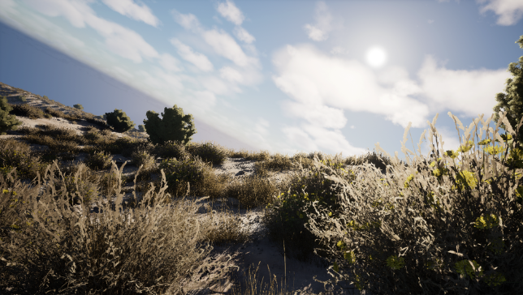
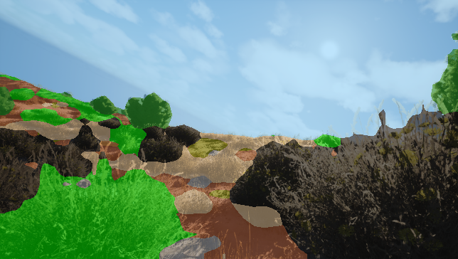
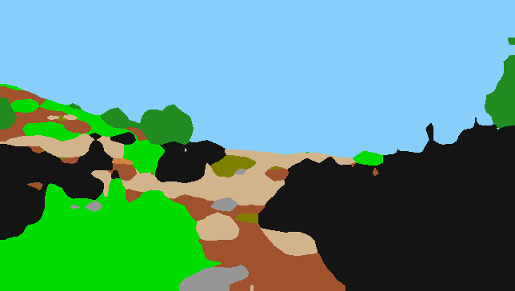

# Result #0007

| Field | Value |
|---|---|
| **Timestamp** | 2026-03-10 10:46:26 |
| **Source** | Random Sample — Lush Bushes |
| **Image** | `w0000191.png` |
| **Model** | Phase 5 — DINOv2 ViT-Base + UPerNet (IoU 0.5294, TTA 0.5310) |
| **Device** | cuda |
| **TTA** | ✅ HFlip average |

## Visualisations

| 📷 Original | 🎨 Segmentation Overlay | 🗺️ Prediction Mask |
|---|---|---|
|  |  |  |

## Overall Metrics (vs Ground Truth)

| Metric | Value |
|---|---|
| **Mean IoU** | 0.5165 |
| **Pixel Accuracy** | 0.8480 (84.80%) |

## Per-Class Breakdown

| Class | IoU | Dice | Pred Pixels | GT Pixels |
|---|---|---|---|---|
| **Background** | 0.7691 | 0.8695 | 61,955 | 57,395 |
| **Trees** | 0.7357 | 0.8477 | 6,273 | 6,125 |
| **Lush Bushes** | 0.5991 | 0.7493 | 31,960 | 29,390 |
| **Dry Grass** | 0.3400 | 0.5074 | 13,082 | 17,642 |
| **Dry Bushes** | N/A (absent) | 1.0000 | 0 | 0 |
| **Ground Clutter** | 0.0855 | 0.1575 | 1,393 | 3,635 |
| **Logs** | 0.4229 | 0.5944 | 161 | 125 |
| **Rocks** | 0.3425 | 0.5103 | 2,681 | 2,473 |
| **Landscape** | 0.3911 | 0.5623 | 13,836 | 14,734 |
| **Sky** | 0.9629 | 0.9811 | 103,075 | 102,897 |

---
*Auto-generated by TESTING_INTERFACE/app.py — Offroad Segmentation Project*