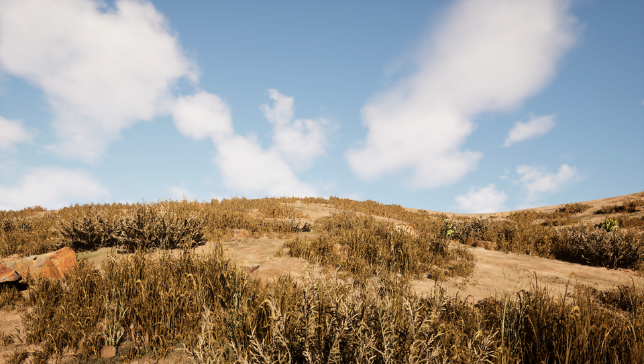
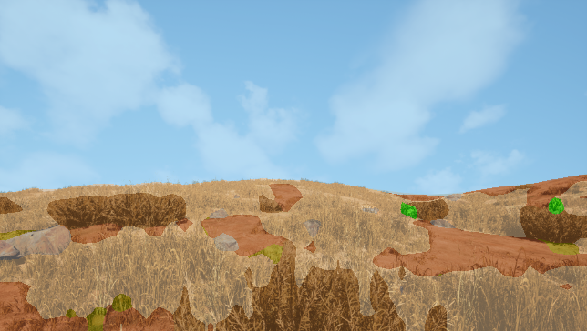
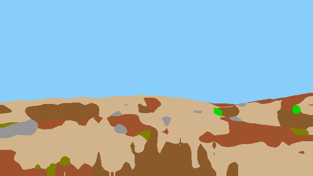

# Result #0008

| Field | Value |
|---|---|
| **Timestamp** | 2026-03-10 14:08:25 |
| **Source** | Random Sample — Lush Bushes |
| **Image** | `cc0000268.png` |
| **Model** | Phase 5 — DINOv2 ViT-Base + UPerNet (IoU 0.5294, TTA 0.5310) |
| **Device** | cuda |
| **TTA** | ✅ HFlip average |

## Visualisations

| 📷 Original | 🎨 Segmentation Overlay | 🗺️ Prediction Mask |
|---|---|---|
|  |  |  |

## Overall Metrics (vs Ground Truth)

| Metric | Value |
|---|---|
| **Mean IoU** | 0.5539 |
| **Pixel Accuracy** | 0.8828 (88.28%) |

## Per-Class Breakdown

| Class | IoU | Dice | Pred Pixels | GT Pixels |
|---|---|---|---|---|
| **Background** | N/A (absent) | 1.0000 | 0 | 0 |
| **Trees** | N/A (absent) | 1.0000 | 0 | 0 |
| **Lush Bushes** | 0.4943 | 0.6615 | 455 | 325 |
| **Dry Grass** | 0.6725 | 0.8042 | 58,815 | 60,822 |
| **Dry Bushes** | 0.5182 | 0.6827 | 20,665 | 14,821 |
| **Ground Clutter** | 0.1585 | 0.2736 | 1,842 | 2,785 |
| **Logs** | N/A (absent) | 1.0000 | 0 | 0 |
| **Rocks** | 0.5714 | 0.7272 | 3,219 | 3,252 |
| **Landscape** | 0.4677 | 0.6373 | 18,056 | 20,984 |
| **Sky** | 0.9946 | 0.9973 | 131,364 | 131,427 |

---
*Auto-generated by TESTING_INTERFACE/app.py — Offroad Segmentation Project*