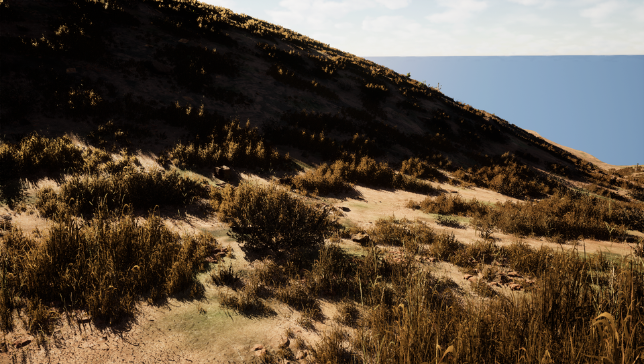
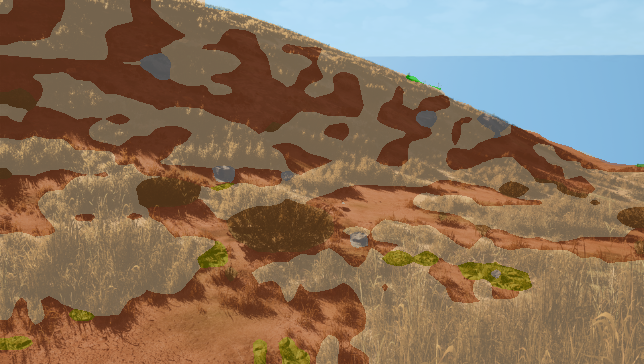
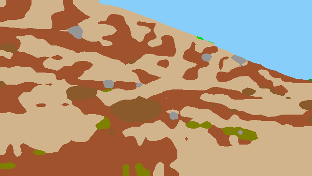

# Result #0010

| Field | Value |
|---|---|
| **Timestamp** | 2026-03-10 19:12:56 |
| **Source** | Random Sample — Rocks |
| **Image** | `cc0000804.png` |
| **Model** | Phase 5 — DINOv2 ViT-Base + UPerNet (IoU 0.5294, TTA 0.5310) |
| **Device** | cuda |
| **TTA** | ✅ HFlip average |

## Visualisations

| 📷 Original | 🎨 Segmentation Overlay | 🗺️ Prediction Mask |
|---|---|---|
|  |  |  |

## Overall Metrics (vs Ground Truth)

| Metric | Value |
|---|---|
| **Mean IoU** | 0.4010 |
| **Pixel Accuracy** | 0.7861 (78.61%) |

## Per-Class Breakdown

| Class | IoU | Dice | Pred Pixels | GT Pixels |
|---|---|---|---|---|
| **Background** | N/A (absent) | 1.0000 | 0 | 0 |
| **Trees** | 0.0625 | 0.1176 | 23 | 28 |
| **Lush Bushes** | 0.0833 | 0.1538 | 68 | 75 |
| **Dry Grass** | 0.6649 | 0.7987 | 106,956 | 102,137 |
| **Dry Bushes** | 0.4191 | 0.5906 | 8,112 | 8,406 |
| **Ground Clutter** | 0.1677 | 0.2873 | 4,049 | 5,761 |
| **Logs** | N/A (absent) | 1.0000 | 0 | 0 |
| **Rocks** | 0.2463 | 0.3952 | 1,982 | 2,628 |
| **Landscape** | 0.5771 | 0.7318 | 75,363 | 77,514 |
| **Sky** | 0.9871 | 0.9935 | 37,863 | 37,867 |

---
*Auto-generated by TESTING_INTERFACE/app.py — Offroad Segmentation Project*