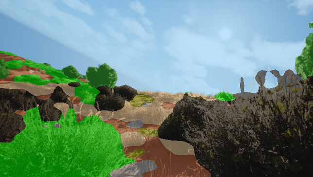
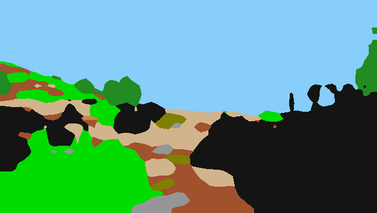

# Result #0011

| Field | Value |
|---|---|
| **Timestamp** | 2026-03-13 18:16:45 |
| **Source** | Random Sample — Lush Bushes |
| **Image** | `w0000191.png` |
| **Model** | Phase 5 — DINOv2 ViT-Base + UPerNet (IoU 0.5294, TTA 0.5310) |
| **Device** | cuda |
| **TTA** | ✅ HFlip average |

## Visualisations

| 📷 Original | 🎨 Segmentation Overlay | 🗺️ Prediction Mask |
|---|---|---|
|  |  |  |

## Overall Metrics (vs Ground Truth)

| Metric | Value |
|---|---|
| **Mean IoU** | 0.5239 |
| **Pixel Accuracy** | 0.8483 (84.83%) |

## Per-Class Breakdown

| Class | IoU | Dice | Pred Pixels | GT Pixels |
|---|---|---|---|---|
| **Background** | 0.7727 | 0.8718 | 61,875 | 57,395 |
| **Trees** | 0.7415 | 0.8516 | 6,290 | 6,125 |
| **Lush Bushes** | 0.6012 | 0.7509 | 33,865 | 29,390 |
| **Dry Grass** | 0.3483 | 0.5167 | 13,387 | 17,642 |
| **Dry Bushes** | N/A (absent) | 1.0000 | 0 | 0 |
| **Ground Clutter** | 0.1075 | 0.1942 | 2,019 | 3,635 |
| **Logs** | 0.4315 | 0.6028 | 157 | 125 |
| **Rocks** | 0.3766 | 0.5471 | 2,908 | 2,473 |
| **Landscape** | 0.3726 | 0.5429 | 12,184 | 14,734 |
| **Sky** | 0.9633 | 0.9813 | 101,731 | 102,897 |

---
*Auto-generated by TESTING_INTERFACE/app.py — Offroad Segmentation Project*