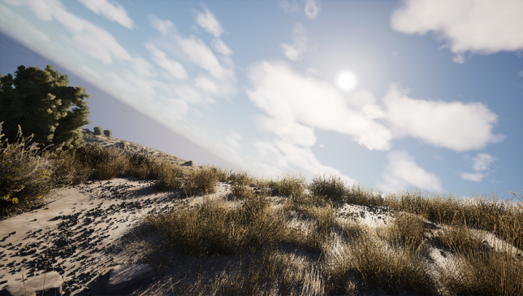
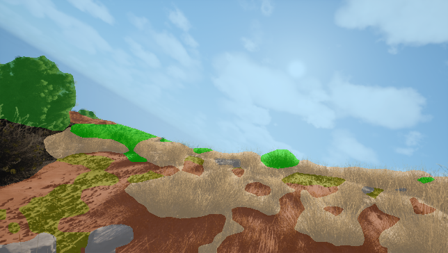
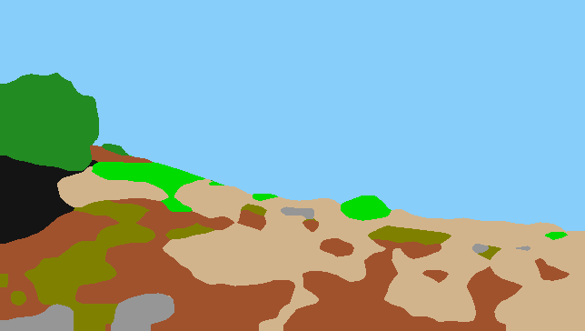
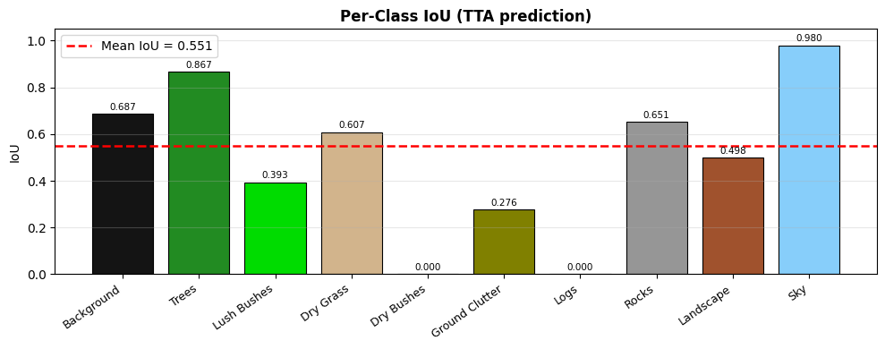

# Result #0015

| Field | Value |
|---|---|
| **Timestamp** | 2026-03-13 18:33:45 |
| **Source** | Fixed Sample — Background #2 |
| **Image** | `w0000216.png` |
| **Model** | Phase 5 — DINOv2 ViT-Base + UPerNet (IoU 0.5294, TTA 0.5310) |
| **Device** | cuda |
| **TTA** | ✅ HFlip average |

## Visualisations

| 📷 Original | 🎨 Segmentation Overlay | 🗺️ Prediction Mask |
|---|---|---|
|  |  |  |

### Per-Class IoU Chart

## Overall Metrics (vs Ground Truth)

| Metric | Value |
|---|---|
| **Mean IoU** | 0.5511 |
| **Pixel Accuracy** | 0.8608 (86.08%) |

## Per-Class Breakdown

| Class | IoU | Dice | Pred Pixels | GT Pixels |
|---|---|---|---|---|
| **Background** | 0.6867 | 0.8142 | 5,536 | 5,780 |
| **Trees** | 0.8667 | 0.9286 | 9,848 | 9,534 |
| **Lush Bushes** | 0.3934 | 0.5646 | 4,191 | 3,414 |
| **Dry Grass** | 0.6073 | 0.7557 | 40,000 | 38,985 |
| **Dry Bushes** | N/A (absent) | 1.0000 | 0 | 0 |
| **Ground Clutter** | 0.2765 | 0.4332 | 10,445 | 9,579 |
| **Logs** | 0.0000 | 0.0000 | 0 | 9 |
| **Rocks** | 0.6510 | 0.7886 | 4,321 | 3,706 |
| **Landscape** | 0.4984 | 0.6652 | 33,725 | 36,714 |
| **Sky** | 0.9801 | 0.9900 | 126,350 | 126,695 |

---
*Auto-generated by TESTING_INTERFACE/app.py — Offroad Segmentation Project*