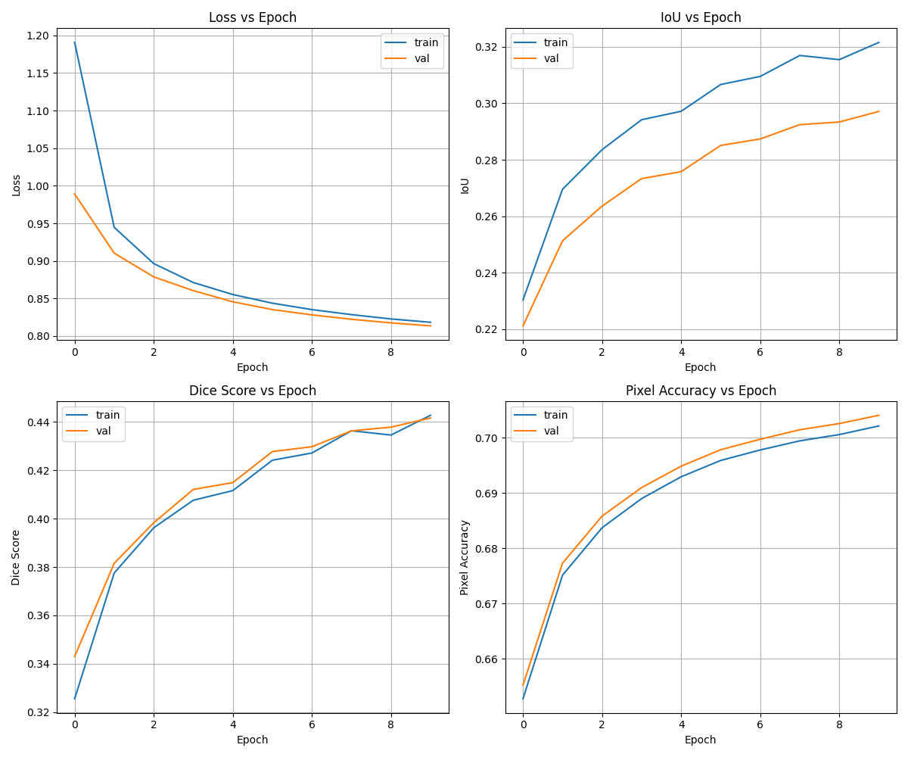

# Phase 1 — Baseline Training Report

> **Status**: ✅ COMPLETED  
> **Date**: 2026-02-27  
> **Duration**: ~83 minutes (10 epochs)  
> **Best Val IoU**: **0.2971** (Epoch 10)

---

## 1. Objective

Run the provided `train_segmentation.py` script **without any modifications** to establish a baseline performance metric. This gives us a reference point to measure all future improvements against.

---

## 2. Environment & Hardware

| Component   | Details                                |
| ----------- | -------------------------------------- |
| **GPU**     | NVIDIA GeForce RTX 3050 6GB Laptop GPU |
| **CUDA**    | 12.6                                   |
| **PyTorch** | 2.10.0+cu126                           |
| **OS**      | Windows 10                             |
| **Python**  | 3.11.9                                 |
| **RAM**     | 16 GB DDR4                             |

---

## 3. Training Configuration

| Parameter           | Value                                           |
| ------------------- | ----------------------------------------------- |
| **Backbone**        | DINOv2 ViT-Small (`dinov2_vits14`) — **frozen** |
| **Seg Head**        | ConvNeXt-style (simple Conv2d stack)            |
| **Optimizer**       | SGD (lr=1e-4, momentum=0.9)                     |
| **Learning Rate**   | 1e-4 (constant, no scheduler)                   |
| **Epochs**          | 10                                              |
| **Batch Size**      | 2                                               |
| **Image Size**      | 476×266 (nearest multiple of 14)                |
| **Loss**            | CrossEntropyLoss (unweighted)                   |
| **Augmentations**   | **None**                                        |
| **Mixed Precision** | No                                              |
| **Checkpointing**   | Final model only                                |

### Why these settings?

The baseline uses the **exact script provided** by the hackathon organizers. A DINOv2 ViT-Small backbone is frozen (only the segmentation head is trained). This is intentionally minimal — only 10 epochs, no augmentations, no scheduler.

---

## 4. Dataset Split

| Split      | Samples      |
| ---------- | ------------ |
| Training   | 2,857 images |
| Validation | 317 images   |

All images are 960×540 RGB, resized to 476×266 for the ViT-14 patch grid.

---

## 5. Per-Epoch Results

| Epoch  | Train Loss |  Val Loss  | Train IoU  |  Val IoU   | Train Dice |  Val Dice  | Train Acc  |  Val Acc   |
| :----: | :--------: | :--------: | :--------: | :--------: | :--------: | :--------: | :--------: | :--------: |
|   1    |   1.1907   |   0.9890   |   0.2303   |   0.2211   |   0.3256   |   0.3430   |   65.28%   |   65.52%   |
|   2    |   0.9447   |   0.9104   |   0.2695   |   0.2513   |   0.3775   |   0.3815   |   67.51%   |   67.73%   |
|   3    |   0.8965   |   0.8788   |   0.2836   |   0.2636   |   0.3962   |   0.3983   |   68.37%   |   68.58%   |
|   4    |   0.8713   |   0.8605   |   0.2942   |   0.2733   |   0.4076   |   0.4120   |   68.90%   |   69.10%   |
|   5    |   0.8553   |   0.8457   |   0.2972   |   0.2758   |   0.4116   |   0.4149   |   69.29%   |   69.49%   |
|   6    |   0.8438   |   0.8353   |   0.3067   |   0.2851   |   0.4241   |   0.4277   |   69.59%   |   69.78%   |
|   7    |   0.8352   |   0.8282   |   0.3095   |   0.2874   |   0.4271   |   0.4297   |   69.78%   |   69.97%   |
|   8    |   0.8286   |   0.8224   |   0.3170   |   0.2924   |   0.4363   |   0.4362   |   69.95%   |   70.15%   |
|   9    |   0.8228   |   0.8176   |   0.3155   |   0.2934   |   0.4345   |   0.4378   |   70.06%   |   70.26%   |
| **10** | **0.8184** | **0.8136** | **0.3216** | **0.2971** | **0.4427** | **0.4416** | **70.22%** | **70.41%** |

---

## 6. Epoch-by-Epoch Analysis

### Epoch 1 — Cold Start

- **Val IoU: 0.2211** — The model starts with random segmentation head weights while the DINOv2 backbone provides pre-trained features.
- Loss is high (1.19 train, 0.99 val) as the head hasn't learned to map features to classes yet.
- The large gap between train and val loss is expected during initial epochs.

### Epochs 2-4 — Rapid Improvement

- **Val IoU jumps from 0.22 → 0.27** — the segmentation head is quickly learning to associate DINOv2 features with class labels.
- Loss drops significantly (~20% reduction in val loss).
- The model starts learning the easy classes first (Sky is very distinct visually).

### Epochs 5-7 — Slowing Down

- **Val IoU: 0.28 → 0.29** — improvement rate decreases significantly.
- The model has learned the "easy" patterns and now struggles with harder classes (small objects, texturally similar classes).
- Train and val metrics track closely — **no overfitting** detected.

### Epochs 8-10 — Still Improving but Slowly

- **Final Val IoU: 0.2971** — model is still improving at epoch 10, suggesting **significant underfitting**.
- Val loss decreased nearly linearly from epoch 1 to 10 — the model hasn't found its minimum yet.
- The gap between train IoU (0.3216) and val IoU (0.2971) is small, confirming **no overfitting**.

---

## 7. Training Curve Analysis

### What the curves tell us:

1. **Loss curves (top-left)**: Both train and val loss decrease steadily. The near-parallel lines indicate healthy training with no overfitting. Critically, the curves show **no sign of convergence** — they're still going down at epoch 10, meaning more epochs would definitely help.

2. **IoU curves (top-right)**: Steadily increasing but at a decreasing rate. The model went from 0.22 → 0.30 in 10 epochs, but the improvement per epoch got smaller. This is partly because SGD with constant lr=1e-4 is a very slow optimizer for this task.

3. **Dice curves (bottom-left)**: Follow the same trend as IoU. Dice started at 0.33 and ended at 0.44. The Dice-IoU gap is consistent, as expected.

4. **Accuracy curves (bottom-right)**: 65% → 70% over 10 epochs. Note that pixel accuracy can be misleading in segmentation because dominant classes (Sky, Landscape, Dry Grass) make up ~75% of all pixels, so getting them right inflates accuracy while rare classes contribute almost nothing.

---

## 8. Key Observations & Diagnosis

### ✅ What went right:

- **No overfitting** — train and val metrics are nearly identical
- **Stable training** — no spikes, crashes, or NaN values
- **DINOv2 features are useful** — even with a simple head, IoU reaches 0.30

### ❌ What went wrong:

1. **Severe underfitting** — 10 epochs is far too few. The model was still improving linearly.
2. **No augmentations** — the model sees the exact same images every epoch, limiting generalization.
3. **SGD with constant lr** — very slow convergence. AdamW would be much faster.
4. **No class weighting** — rare classes like Logs (0.07% of pixels) get almost no gradient signal.
5. **Unweighted CrossEntropy** — treats all pixel errors equally, but some classes need more attention.

### Root cause of low IoU:

The primary bottleneck is **training time** (only 10 epochs) combined with a **slow optimizer** (SGD at 1e-4). The model has the capacity to do better — it just hasn't trained long enough.

---

## 9. Final Scores

| Metric             | Train  |    Val     |
| ------------------ | :----: | :--------: |
| **IoU**            | 0.3216 | **0.2971** |
| **Dice**           | 0.4427 |   0.4416   |
| **Pixel Accuracy** | 70.22% |   70.41%   |
| **Loss**           | 0.8184 |   0.8136   |

---

## 10. Output Files

| File                     | Description                  |
| ------------------------ | ---------------------------- |
| `evaluation_metrics.txt` | Full per-epoch metrics table |
| `all_metrics_curves.png` | Combined 2×2 training curves |
| `iou_curves.png`         | IoU-specific plot            |
| `dice_curves.png`        | Dice-specific plot           |
| `training_curves.png`    | Loss curves                  |

---

## 11. Conclusion & Next Steps

Phase 1 establishes a **baseline IoU of 0.2971**. The model is severely undertrained and lacks augmentations, a proper optimizer, and class balancing. The clear path forward is:

1. **More epochs** (30+) to let the model converge
2. **AdamW optimizer** with learning rate scheduler for faster convergence
3. **Data augmentations** to prevent memorization and improve generalization
4. **Class-weighted loss** to handle the extreme class imbalance (Logs = 0.07% vs Sky = 34%)
5. **Mixed precision** to speed up training on the 6GB RTX 3050

These improvements are implemented in **Phase 2**.
