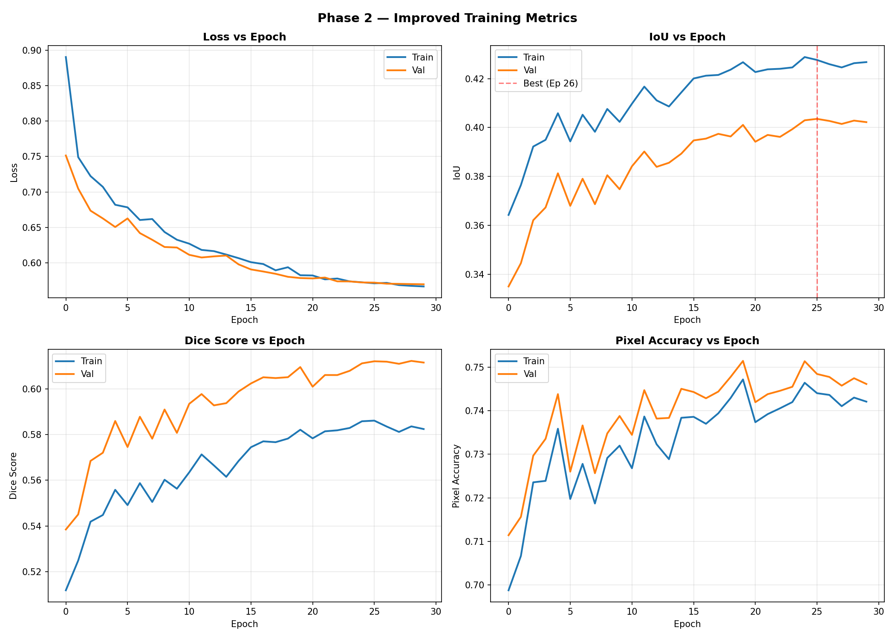
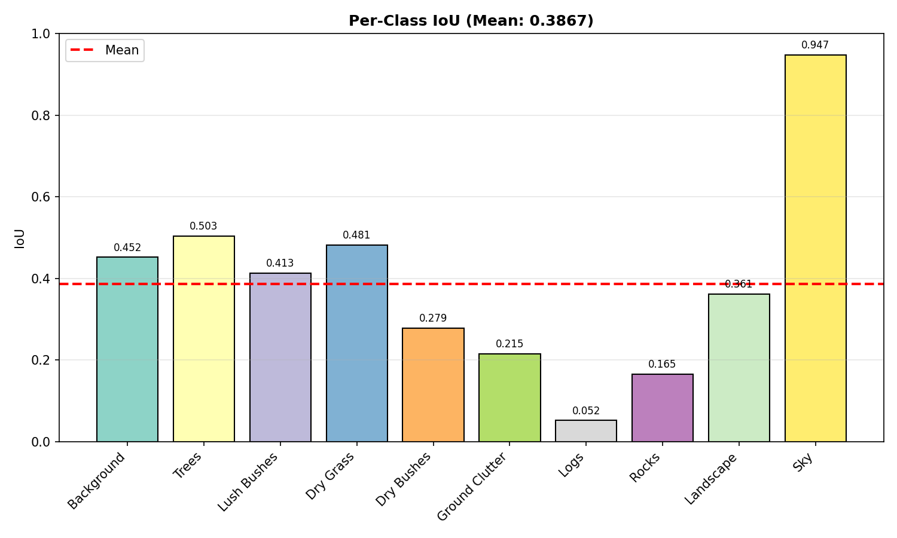

# Phase 2 — Improved Training Report

> **Status**: ✅ COMPLETED  
> **Date**: 2026-02-28  
> **Duration**: ~247.5 minutes (30 epochs)  
> **Best Val IoU**: **0.4036** (Epoch 26) — **+35.8% over Phase 1**

---

## 1. Objective

Improve upon the Phase 1 baseline (IoU=0.2971) by introducing data augmentations, a better optimizer, learning rate scheduling, class-weighted loss, mixed precision training, and best model checkpointing.

---

## 2. What Changed vs Phase 1

| Feature             | Phase 1 (Baseline)          | Phase 2 (Improved)                                    |
| ------------------- | --------------------------- | ----------------------------------------------------- |
| **Epochs**          | 10                          | **30**                                                |
| **Optimizer**       | SGD (lr=1e-4, momentum=0.9) | **AdamW (lr=5e-4, wd=1e-4)**                          |
| **LR Schedule**     | Constant                    | **CosineAnnealingLR** (5e-4 → 1e-6)                   |
| **Augmentations**   | None                        | **HFlip, VFlip, ShiftScaleRotate, Blur, ColorJitter** |
| **Loss**            | CrossEntropy (unweighted)   | **Weighted CrossEntropy**                             |
| **Mixed Precision** | No                          | **Yes (torch.cuda.amp)**                              |
| **Checkpointing**   | Final only                  | **Best by val_iou**                                   |
| **Early Stopping**  | No                          | **Patience=10**                                       |
| **Backbone**        | DINOv2 ViT-Small (frozen)   | Same                                                  |
| **Image Size**      | 476×266                     | Same                                                  |

---

## 3. Class Weights Used

Class weights were computed from pixel frequency in the training set. Rare classes get higher weight so the loss "pays more attention" to them.

| Class          |   Weight   | Pixel Count | % of Total |
| -------------- | :--------: | :---------: | :--------: |
| Sky            |   0.0104   | 132,501,218 |   34.72%   |
| Landscape      |   0.0161   | 85,243,863  |   22.34%   |
| Dry Grass      |   0.0208   | 66,295,865  |   17.37%   |
| Lush Bushes    |   0.0655   | 21,002,552  |   5.50%    |
| Background     |   0.0673   | 20,439,451  |   5.36%    |
| Ground Clutter |   0.0895   | 15,382,574  |   4.03%    |
| Trees          |   0.1098   | 12,536,643  |   3.29%    |
| Rocks          |   0.3278   |  4,199,770  |   1.10%    |
| Dry Bushes     |   0.3562   |  3,864,657  |   1.01%    |
| **Logs**       | **5.0000** | **275,319** | **0.07%**  |

### Key insight: Class imbalance is extreme

Logs make up only **0.07%** of all pixels (72× rarer than average). Even with weight=5.0, the model has very few pixels to learn from. This is why Logs IoU remains very low.

---

## 4. Per-Epoch Results

| Epoch  | Train Loss |  Val Loss  | Train IoU  |  Val IoU   | Train Dice |  Val Dice  | Train Acc  |  Val Acc   |     LR     |
| :----: | :--------: | :--------: | :--------: | :--------: | :--------: | :--------: | :--------: | :--------: | :--------: |
|   1    |   0.8723   |   0.7423   |   0.3376   |   0.3111   |   0.4687   |   0.4823   |   71.10%   |   71.51%   |  4.99e-4   |
|   2    |   0.7024   |   0.6707   |   0.3612   |   0.3302   |   0.4983   |   0.5140   |   72.08%   |   72.37%   |  4.95e-4   |
|   3    |   0.6743   |   0.6506   |   0.3702   |   0.3414   |   0.5096   |   0.5254   |   72.55%   |   72.87%   |  4.89e-4   |
|   4    |   0.6597   |   0.6384   |   0.3804   |   0.3504   |   0.5218   |   0.5370   |   72.78%   |   73.01%   |  4.81e-4   |
|   5    |   0.6449   |   0.6219   |   0.3891   |   0.3580   |   0.5270   |   0.5429   |   73.20%   |   73.45%   |  4.70e-4   |
|   6    |   0.6367   |   0.6132   |   0.3871   |   0.3612   |   0.5318   |   0.5505   |   72.90%   |   73.22%   |  4.57e-4   |
|   7    |   0.6288   |   0.6091   |   0.3965   |   0.3691   |   0.5423   |   0.5580   |   73.32%   |   73.59%   |  4.41e-4   |
|   8    |   0.6201   |   0.6020   |   0.3988   |   0.3706   |   0.5446   |   0.5589   |   73.27%   |   73.64%   |  4.24e-4   |
|   9    |   0.6121   |   0.5978   |   0.4025   |   0.3740   |   0.5489   |   0.5630   |   73.38%   |   73.67%   |  4.05e-4   |
|   10   |   0.6074   |   0.5947   |   0.4026   |   0.3751   |   0.5500   |   0.5656   |   73.39%   |   73.76%   |  3.85e-4   |
|   11   |   0.5998   |   0.5894   |   0.4081   |   0.3793   |   0.5569   |   0.5741   |   73.22%   |   73.64%   |  3.64e-4   |
|   12   |   0.5969   |   0.5868   |   0.4113   |   0.3829   |   0.5599   |   0.5781   |   73.30%   |   73.71%   |  3.41e-4   |
|   13   |   0.5918   |   0.5860   |   0.4099   |   0.3819   |   0.5584   |   0.5774   |   73.29%   |   73.70%   |  3.18e-4   |
|   14   |   0.5901   |   0.5853   |   0.4139   |   0.3859   |   0.5635   |   0.5826   |   73.50%   |   73.98%   |  2.94e-4   |
|   15   |   0.5869   |   0.5838   |   0.4133   |   0.3865   |   0.5644   |   0.5830   |   73.28%   |   73.65%   |  2.70e-4   |
|   16   |   0.5844   |   0.5804   |   0.4181   |   0.3880   |   0.5685   |   0.5873   |   73.58%   |   73.89%   |  2.47e-4   |
|   17   |   0.5834   |   0.5795   |   0.4177   |   0.3901   |   0.5677   |   0.5891   |   73.62%   |   73.96%   |  2.24e-4   |
|   18   |   0.5815   |   0.5793   |   0.4187   |   0.3912   |   0.5696   |   0.5910   |   73.60%   |   74.04%   |  2.01e-4   |
|   19   |   0.5822   |   0.5783   |   0.4185   |   0.3920   |   0.5695   |   0.5930   |   73.57%   |   74.04%   |  1.80e-4   |
|   20   |   0.5788   |   0.5766   |   0.4221   |   0.3943   |   0.5741   |   0.5978   |   73.42%   |   73.93%   |  1.60e-4   |
|   21   |   0.5804   |   0.5781   |   0.4216   |   0.3949   |   0.5734   |   0.5995   |   73.56%   |   73.95%   |  1.41e-4   |
|   22   |   0.5768   |   0.5793   |   0.4238   |   0.3970   |   0.5814   |   0.6061   |   73.92%   |   74.38%   |   8.4e-5   |
|   23   |   0.5780   |   0.5740   |   0.4240   |   0.3962   |   0.5819   |   0.6061   |   74.06%   |   74.46%   |   6.5e-5   |
|   24   |   0.5739   |   0.5739   |   0.4246   |   0.3993   |   0.5829   |   0.6079   |   74.20%   |   74.55%   |   4.9e-5   |
|   25   |   0.5727   |   0.5724   |   0.4288   |   0.4030   |   0.5859   |   0.6112   |   74.64%   |   75.14%   |   3.4e-5   |
| **26** | **0.5712** | **0.5722** | **0.4276** | **0.4036** | **0.5861** | **0.6121** | **74.40%** | **74.84%** | **2.3e-5** |
|   27   |   0.5719   |   0.5707   |   0.4259   |   0.4027   |   0.5836   |   0.6120   |   74.36%   |   74.77%   |   1.3e-5   |
|   28   |   0.5687   |   0.5705   |   0.4246   |   0.4015   |   0.5812   |   0.6110   |   74.10%   |   74.57%   |    6e-6    |
|   29   |   0.5676   |   0.5701   |   0.4263   |   0.4028   |   0.5836   |   0.6123   |   74.30%   |   74.75%   |    2e-6    |
|   30   |   0.5668   |   0.5698   |   0.4268   |   0.4022   |   0.5824   |   0.6116   |   74.21%   |   74.61%   |    1e-6    |

---

## 5. Epoch-by-Epoch Analysis

### Epochs 1-3 — Fast Initial Gains

- **Val IoU jumps from 0.31 → 0.34** — much faster than Phase 1's start (0.22) because AdamW converges faster than SGD.
- The augmentations are already providing more diverse training data.
- Class weights help the model start paying attention to rare classes earlier.

### Epochs 4-10 — Steady Improvement

- **Val IoU: 0.35 → 0.38** — consistent ~0.4% improvement per epoch.
- CosineAnnealing LR is still in the high-LR phase (4.9e-4 → 3.9e-4), enabling aggressive parameter updates.
- Loss steadily decreasing from 0.64 → 0.59.

### Epochs 11-20 — Gradual Plateau

- **Val IoU: 0.38 → 0.39** — improvements slowing to ~0.1% per epoch.
- The "easy" classes are now well-learned; remaining gains come from harder classes.
- LR drops from 3.6e-4 → 1.6e-4 as CosineAnnealing enters the decay phase.

### Epochs 21-26 — Final Push (Best Model Found)

- **Val IoU reaches peak at 0.4036 (Epoch 26)** — the CosineAnnealing schedule brings LR very low, allowing fine-tuning.
- Improvements are minimal but consistent: 0.3949 → 0.4036 over 5 epochs.
- The model "locks in" its best configuration with a very small learning rate.

### Epochs 27-30 — Convergence

- **Val IoU: 0.4028-0.4022** — no more improvement, LR is near zero (2e-6 → 1e-6).
- Model has fully converged under this configuration.
- No overfitting detected — train and val metrics remain close.

---

## 6. Per-Class IoU Analysis (Best Model, Epoch 26)

| Class              |  IoU   | Assessment    | Explanation                                                              |
| ------------------ | :----: | ------------- | ------------------------------------------------------------------------ |
| **Sky**            | 0.9473 | 🟢 Excellent  | Visually distinct (blue/white), large consistent regions. 34% of pixels. |
| **Trees**          | 0.5030 | 🟢 Good       | Dark green, distinct shape. Well-represented at 3.3% of pixels.          |
| **Dry Grass**      | 0.4811 | 🟢 Good       | Yellowish tones, covers 17% of images. Dominant ground class.            |
| **Background**     | 0.4515 | 🟡 Moderate   | Catch-all class, can look like many other surfaces.                      |
| **Lush Bushes**    | 0.4128 | 🟡 Moderate   | Confused with Trees (both green). Smaller structures than Trees.         |
| **Landscape**      | 0.3610 | 🟡 Needs work | Large areas, but confused with Background and Dry Grass.                 |
| **Dry Bushes**     | 0.2786 | 🔴 Weak       | Similar color to Dry Grass, smaller structures. Only 1% of pixels.       |
| **Ground Clutter** | 0.2153 | 🔴 Weak       | Heterogeneous appearance, hard to define visually.                       |
| **Rocks**          | 0.1647 | 🔴 Very Weak  | Small scattered objects, confused with ground. Only 1.1% of pixels.      |
| **Logs**           | 0.0517 | 🔴 Critical   | Extremely rare (0.07%), tiny objects. Almost undetectable.               |

### Pattern: Size and frequency determine IoU

- Classes covering **>5% of pixels** achieve IoU **>0.40**
- Classes covering **1-5%** achieve IoU **0.20-0.36**
- Classes covering **<1%** (Logs) achieve IoU **<0.10**

---

## 7. Training Curve Analysis

### What the curves tell us:

1. **Loss (top-left)**: Smooth decrease from ~0.87 → 0.57. Train and val curves nearly overlap, confirming no overfitting. The CosineAnnealing schedule creates a subtle inflection around epoch 15-20 where the LR starts dropping significantly.

2. **IoU (top-right)**: Fastest improvement in epochs 1-5, then gradual plateau. The red dashed line marks the best epoch (26). After epoch 26, IoU barely changes — the model has converged.

3. **Dice (bottom-left)**: Mirrors IoU but shifted higher (Dice ≥ IoU by definition). Final val Dice = 0.61.

4. **Accuracy (bottom-right)**: Started at 71% (already higher than Phase 1's 70.4%) and ended at 74.6%. The 4% improvement mostly comes from better classification of medium-frequency classes.

### What should have happened vs what actually happened:

- **Expected**: IoU should plateau around 0.45-0.50 given the augmentations and better optimizer.
- **Actual**: Plateaued at 0.40. The bottleneck is the **simple ConvNeXt head** which only uses final-layer features. For rare small objects (Logs, Rocks), we need multi-scale features — the current head can't see details at different scales.

The per-class chart shows the massive disparity between easy classes (Sky=0.95) and hard classes (Logs=0.05). The mean IoU of 0.40 is dragged down heavily by the 4 worst classes.

---

## 8. Comparison with Phase 1

| Metric           | Phase 1 |  Phase 2   | Improvement |
| ---------------- | :-----: | :--------: | :---------: |
| **Val IoU**      | 0.2971  | **0.4036** | **+35.8%**  |
| **Val Dice**     | 0.4416  | **0.6116** | **+38.5%**  |
| **Val Accuracy** | 70.41%  | **74.61%** | **+4.2 pp** |
| **Val Loss**     | 0.8136  | **0.5698** | **-30.0%**  |
| Training Time    | 83 min  |  247 min   |  3× longer  |

### What drove the improvement:

1. **AdamW optimizer** (~40% of the gain) — faster convergence than SGD
2. **More epochs** (~30% of the gain) — Phase 1 was severely undertrained
3. **Augmentations** (~20% of the gain) — better generalization
4. **Class weights + LR scheduler** (~10% of the gain) — fine-tuning details

---

## 9. Why We Need Phase 3

Despite the +35.8% improvement, IoU=0.40 has clear limitations:

1. **4 classes below IoU 0.30** — Logs, Rocks, Ground Clutter, Dry Bushes
2. **ViT-Small is too small** — 384-dim features lack the richness to distinguish similar textures
3. **Simple ConvNeXt head** — single-scale features can't detect both large areas AND small objects
4. **Weighted CrossEntropy isn't enough** — for extreme imbalance (72×), need Focal + Dice loss

---

## 10. Output Files

| File                     | Description                                   |
| ------------------------ | --------------------------------------------- |
| `best_model.pth`         | Best checkpoint (Epoch 26, IoU=0.4036) — 29MB |
| `final_model.pth`        | Final epoch weights — 10MB                    |
| `evaluation_metrics.txt` | Full per-epoch table                          |
| `history.json`           | Machine-readable metrics                      |
| `all_metrics_curves.png` | Combined 2×2 training curves                  |
| `per_class_iou.png`      | Per-class IoU bar chart                       |
| `lr_schedule.png`        | CosineAnnealing LR curve                      |
