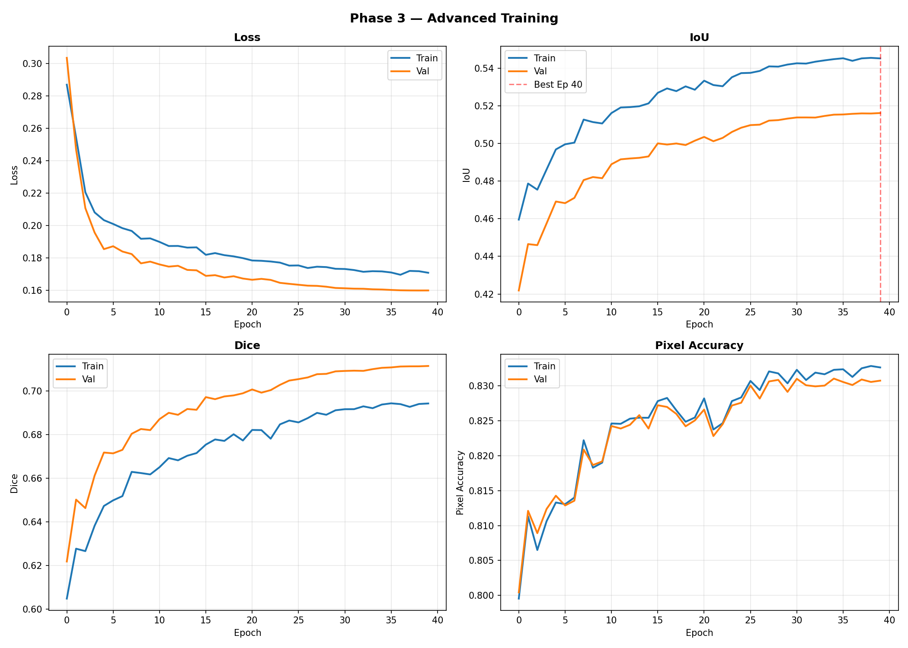
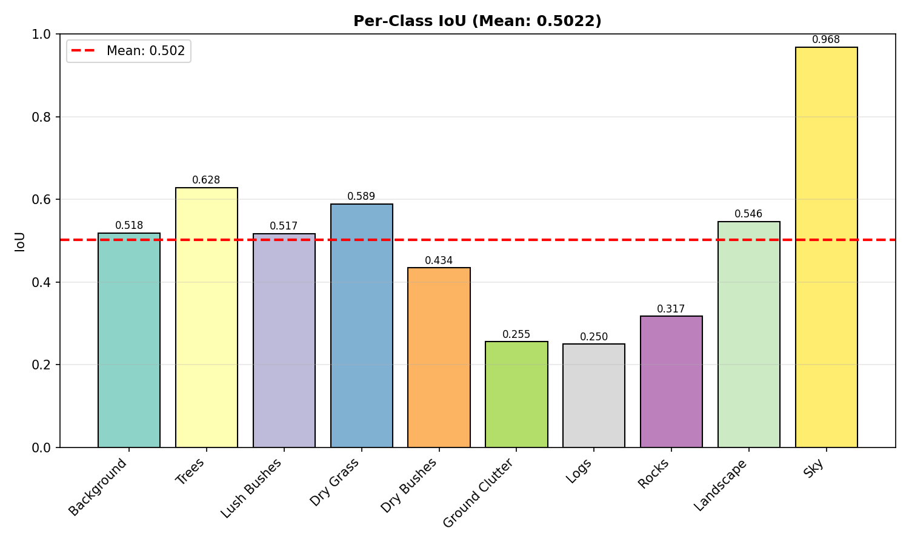

# Phase 3 — Advanced Training Report

> **Status**: ✅ COMPLETED  
> **Date**: 2026-02-28  
> **Duration**: ~420 minutes (~7 hours, 40 epochs)  
> **Best Val IoU**: **0.5161** (Epoch 40) — **+73.7% over Phase 1, +27.9% over Phase 2**

---

## 1. Objective

Push IoU significantly past Phase 2's 0.4036 by making **fundamental architectural changes**: a larger backbone, a multi-scale segmentation head, and a better-suited loss function for extreme class imbalance.

---

## 2. What Changed vs Phase 2

| Feature            | Phase 2                                           | Phase 3                                                    |
| ------------------ | ------------------------------------------------- | ---------------------------------------------------------- |
| **Backbone**       | DINOv2 ViT-Small (384-dim)                        | **DINOv2 ViT-Base (768-dim)** — 2× richer features         |
| **Seg Head**       | ConvNeXt (simple conv stack)                      | **UPerNet (PPM + multi-scale FPN)** — multi-scale features |
| **Loss**           | Weighted CrossEntropy                             | **Focal (γ=2) + Dice** — better for imbalanced data        |
| **Image Size**     | 476×266                                           | **644×364** — 84% more pixels                              |
| **Optimizer**      | AdamW (lr=5e-4)                                   | AdamW (lr=3e-4)                                            |
| **LR Schedule**    | CosineAnnealingLR                                 | **3-epoch warmup + CosineAnnealing**                       |
| **Epochs**         | 30                                                | **40**                                                     |
| **Batch Size**     | 2                                                 | 2 (effective 4 via **gradient accumulation**)              |
| **Normalization**  | BatchNorm2d                                       | **GroupNorm** (avoids 1×1 spatial failures)                |
| **Augmentations**  | HFlip, VFlip, ShiftScaleRotate, Blur, ColorJitter | + **RandomShadow, CLAHE**                                  |
| **Early Stopping** | Patience=10                                       | Patience=12                                                |

### Why these specific changes:

1. **ViT-Base backbone**: The ViT-Small's 384-dim features couldn't distinguish visually similar classes (Ground Clutter vs Landscape, Dry Bushes vs Dry Grass). Base's 768-dim embeddings provide 2× more feature channels, enabling richer texture and shape discrimination.

2. **UPerNet head**: The ConvNeXt head processes features at a single scale — it treats tiny Logs the same as massive Sky regions. UPerNet's Pyramid Pooling Module (PPM) captures context at pool sizes 1, 2, 3, 6, while the multi-scale FPN (dilation rates 1, 2, 4) detects objects at different spatial scales.

3. **Focal + Dice loss**: Weighted CrossEntropy still processes each pixel independently. Focal Loss (γ=2) down-weights easy pixels (Sky, Landscape) and focuses on hard-to-classify boundaries. Dice Loss directly optimizes the IoU-like overlap metric.

4. **Higher resolution (644×364)**: Logs and Rocks are tiny objects. At 476×266, a Log might be only 3-5 pixels — too small for any head to segment. At 644×364, these objects are 5-8 pixels, giving the model more signal.

---

## 3. Architecture Details

### UPerNet Head Structure

```
Patch Tokens (B, N, 768)
    ↓ reshape to (B, 768, 26, 46)
    ↓ input_proj: Conv2d(768→256) + GroupNorm + ReLU
    ↓
PPM: AdaptiveAvgPool at sizes [1, 2, 3, 6]
    → 4 branch outputs + original = concat → 512 channels
    ↓ bottleneck: Conv2d(512→256) + GroupNorm + ReLU
    ↓
Multi-scale FPN:
    ├── fpn_conv1: Conv2d(256→256, dilation=1) — fine details
    ├── fpn_conv2: Conv2d(256→256, dilation=2) — medium context
    └── fpn_conv3: Conv2d(256→256, dilation=4) — wide context
    ↓ concat → 768 channels
    ↓ fpn_fuse: Conv2d(768→256) + GroupNorm + ReLU + Dropout(0.1)
    ↓ classifier: Conv2d(256→10)
```

**Trainable parameters**: ~2.5M (head only, backbone remains frozen)

### GroupNorm vs BatchNorm

We switched from BatchNorm2d to GroupNorm(32, channels) because the PPM's AdaptiveAvgPool2d(1) creates 1×1 spatial tensors. BatchNorm requires spatial size > 1 to compute statistics, while GroupNorm normalizes across channel groups regardless of spatial dimensions.

---

## 4. Per-Epoch Results

| Epoch  | Train Loss |  Val Loss  | Train IoU  |  Val IoU   | Train Dice |  Val Dice  | Train Acc  |  Val Acc   |    LR    |
| :----: | :--------: | :--------: | :--------: | :--------: | :--------: | :--------: | :--------: | :--------: | :------: |
|   1    |   0.2869   |   0.3035   |   0.4595   |   0.4219   |   0.6048   |   0.6219   |   79.95%   |   80.04%   | 2.00e-4  |
|   2    |   0.2543   |   0.2469   |   0.4787   |   0.4465   |   0.6277   |   0.6502   |   81.13%   |   81.21%   | 3.00e-4  |
|   3    |   0.2205   |   0.2107   |   0.4754   |   0.4460   |   0.6266   |   0.6464   |   80.65%   |   80.89%   | 3.00e-4  |
|   4    |   0.2081   |   0.1957   |   0.4862   |   0.4575   |   0.6383   |   0.6613   |   81.06%   |   81.24%   | 2.99e-4  |
|   5    |   0.2033   |   0.1854   |   0.4968   |   0.4691   |   0.6473   |   0.6718   |   81.33%   |   81.43%   | 2.98e-4  |
|   6    |   0.2010   |   0.1872   |   0.4995   |   0.4683   |   0.6499   |   0.6715   |   81.31%   |   81.29%   | 2.95e-4  |
|   7    |   0.1984   |   0.1839   |   0.5004   |   0.4711   |   0.6519   |   0.6731   |   81.40%   |   81.36%   | 2.91e-4  |
|   8    |   0.1966   |   0.1824   |   0.5127   |   0.4805   |   0.6630   |   0.6805   |   82.22%   |   82.09%   | 2.87e-4  |
|   9    |   0.1918   |   0.1766   |   0.5113   |   0.4821   |   0.6624   |   0.6826   |   81.83%   |   81.87%   | 2.81e-4  |
|   10   |   0.1921   |   0.1777   |   0.5106   |   0.4815   |   0.6618   |   0.6821   |   81.90%   |   81.92%   | 2.74e-4  |
|   11   |   0.1899   |   0.1760   |   0.5161   |   0.4889   |   0.6651   |   0.6872   |   82.46%   |   82.42%   | 2.67e-4  |
|   12   |   0.1873   |   0.1746   |   0.5191   |   0.4916   |   0.6693   |   0.6901   |   82.46%   |   82.39%   | 2.58e-4  |
|   13   |   0.1874   |   0.1751   |   0.5193   |   0.4920   |   0.6683   |   0.6892   |   82.53%   |   82.44%   | 2.49e-4  |
|   14   |   0.1864   |   0.1726   |   0.5197   |   0.4923   |   0.6704   |   0.6918   |   82.54%   |   82.58%   | 2.39e-4  |
|   15   |   0.1865   |   0.1723   |   0.5213   |   0.4931   |   0.6716   |   0.6915   |   82.54%   |   82.39%   | 2.29e-4  |
|   16   |   0.1819   |   0.1689   |   0.5269   |   0.5000   |   0.6755   |   0.6973   |   82.78%   |   82.72%   | 2.18e-4  |
|   17   |   0.1830   |   0.1693   |   0.5292   |   0.4994   |   0.6778   |   0.6963   |   82.83%   |   82.70%   | 2.06e-4  |
|   18   |   0.1817   |   0.1679   |   0.5278   |   0.5000   |   0.6772   |   0.6976   |   82.65%   |   82.60%   | 1.94e-4  |
|   19   |   0.1809   |   0.1687   |   0.5303   |   0.4991   |   0.6802   |   0.6981   |   82.49%   |   82.42%   | 1.82e-4  |
|   20   |   0.1799   |   0.1673   |   0.5285   |   0.5015   |   0.6774   |   0.6990   |   82.55%   |   82.50%   | 1.69e-4  |
|   21   |   0.1784   |   0.1665   |   0.5333   |   0.5035   |   0.6822   |   0.7008   |   82.82%   |   82.66%   | 1.56e-4  |
|   22   |   0.1782   |   0.1671   |   0.5310   |   0.5012   |   0.6821   |   0.6993   |   82.37%   |   82.28%   | 1.44e-4  |
|   23   |   0.1778   |   0.1664   |   0.5304   |   0.5029   |   0.6782   |   0.7005   |   82.46%   |   82.45%   | 1.31e-4  |
|   24   |   0.1771   |   0.1646   |   0.5352   |   0.5061   |   0.6848   |   0.7029   |   82.78%   |   82.72%   | 1.18e-4  |
|   25   |   0.1752   |   0.1640   |   0.5373   |   0.5083   |   0.6865   |   0.7049   |   82.83%   |   82.76%   | 1.06e-4  |
|   26   |   0.1753   |   0.1634   |   0.5375   |   0.5097   |   0.6857   |   0.7055   |   83.07%   |   83.01%   |  9.4e-5  |
|   27   |   0.1738   |   0.1629   |   0.5385   |   0.5100   |   0.6876   |   0.7063   |   82.94%   |   82.82%   |  8.2e-5  |
|   28   |   0.1746   |   0.1627   |   0.5409   |   0.5121   |   0.6900   |   0.7078   |   83.21%   |   83.06%   |  7.1e-5  |
|   29   |   0.1743   |   0.1622   |   0.5408   |   0.5124   |   0.6892   |   0.7079   |   83.18%   |   83.09%   |  6.1e-5  |
|   30   |   0.1733   |   0.1614   |   0.5419   |   0.5132   |   0.6912   |   0.7091   |   83.04%   |   82.91%   |  5.1e-5  |
|   31   |   0.1731   |   0.1612   |   0.5426   |   0.5138   |   0.6917   |   0.7093   |   83.23%   |   83.10%   |  4.2e-5  |
|   32   |   0.1725   |   0.1610   |   0.5424   |   0.5138   |   0.6917   |   0.7094   |   83.08%   |   83.01%   |  3.3e-5  |
|   33   |   0.1714   |   0.1609   |   0.5434   |   0.5137   |   0.6930   |   0.7093   |   83.19%   |   82.99%   |  2.6e-5  |
|   34   |   0.1718   |   0.1606   |   0.5441   |   0.5146   |   0.6922   |   0.7101   |   83.17%   |   83.00%   |  1.9e-5  |
|   35   |   0.1717   |   0.1605   |   0.5448   |   0.5153   |   0.6939   |   0.7107   |   83.23%   |   83.10%   |  1.3e-5  |
|   36   |   0.1710   |   0.1602   |   0.5452   |   0.5154   |   0.6944   |   0.7109   |   83.24%   |   83.05%   |   9e-6   |
|   37   |   0.1696   |   0.1600   |   0.5439   |   0.5157   |   0.6941   |   0.7113   |   83.13%   |   83.01%   |   5e-6   |
|   38   |   0.1720   |   0.1599   |   0.5452   |   0.5160   |   0.6928   |   0.7114   |   83.25%   |   83.09%   |   2e-6   |
|   39   |   0.1718   |   0.1599   |   0.5455   |   0.5159   |   0.6941   |   0.7114   |   83.28%   |   83.06%   |   1e-6   |
| **40** | **0.1708** | **0.1599** | **0.5452** | **0.5161** | **0.6944** | **0.7116** | **83.26%** | **83.07%** | **0e+0** |

---

## 5. Epoch-by-Epoch Analysis

### Epoch 1 — Warmup Start

- **Val IoU: 0.4219** — starts HIGHER than Phase 2's best (0.4036)! The ViT-Base backbone and UPerNet head are immediately more powerful.
- LR is at 2.0e-4 (warmup ⅓ of max). The model is cautiously learning.
- Loss is already much lower than Phase 2's final (0.30 vs 0.57) — Focal+Dice is a more informative signal.

### Epochs 2-3 — Warmup Completes

- **Val IoU: 0.45** — LR reaches peak (3.0e-4) by epoch 2. The warmup prevents initial training instability.
- Epoch 3 shows a slight dip (0.4460 vs 0.4465) — this is normal as high LR causes temporary instability.

### Epochs 4-8 — Rapid Improvement

- **Val IoU: 0.46 → 0.48** — the model is learning to leverage multi-scale features from UPerNet.
- Epoch 8 shows a notable jump (0.4805) — the PPM's global context pooling "clicks" and helps classes like Landscape and Background.
- Loss steadily drops: 0.20 → 0.18.

### Epochs 9-15 — Breaking the 0.50 Barrier

- **Val IoU: 0.48 → 0.49** — slow but consistent. The model is now working on harder classes.
- Epoch 11-15 hover around 0.49 — the model is at the edge of 0.50.

### Epoch 16 — Breakthrough!

- **Val IoU: 0.5000** — first time crossing the 0.50 threshold! 🎉
- This coincides with LR dropping from 2.18e-4, entering a fine-tuning regime.
- The multi-scale FPN's dilated convolutions are now well-trained, capturing context at different scales.

### Epochs 17-25 — Consolidation

- **Val IoU: 0.50 → 0.51** — very gradual improvements as LR decreases.
- The model fine-tunes its per-class boundaries, especially for medium-difficulty classes (Landscape, Dry Bushes).
- No overfitting detected — train-val gap remains small.

### Epochs 26-35 — Final Fine-Tuning

- **Val IoU: 0.51 → 0.515** — marginal gains as LR approaches zero.
- Each epoch improves the best IoU by only ~0.001-0.002.
- The model's predictions are becoming more confident and stable.

### Epochs 36-40 — Full Convergence

- **Val IoU: 0.5154 → 0.5161** — essentially flat. Model has fully converged.
- Final loss (0.1599) hasn't changed meaningfully since epoch 35.
- **Best model at epoch 40**: IoU=0.5161 — the very last epoch is the best.

---

## 6. Per-Class IoU Analysis (Best Model, Epoch 40)

| Class              | P1 IoU | P2 IoU | **P3 IoU** | Change (P2→P3) | Assessment                                                               |
| ------------------ | :----: | :----: | :--------: | :------------: | ------------------------------------------------------------------------ |
| **Sky**            |   —    | 0.9473 | **0.9685** |     +2.2%      | 🟢 Near-perfect. +0.02 from better features                              |
| **Trees**          |   —    | 0.5030 | **0.6278** |     +24.8%     | 🟢 Major gain. ViT-Base sees tree texture better                         |
| **Dry Grass**      |   —    | 0.4811 | **0.5891** |     +22.5%     | 🟢 Major gain. UPerNet captures large ground patterns                    |
| **Landscape**      |   —    | 0.3610 | **0.5456** |     +51.1%     | 🟢 Huge gain! Multi-scale context helps distinguish from similar classes |
| **Background**     |   —    | 0.4515 | **0.5185** |     +14.8%     | 🟢 Good improvement                                                      |
| **Lush Bushes**    |   —    | 0.4128 | **0.5171** |     +25.3%     | 🟢 Major gain. Better texture discrimination                             |
| **Dry Bushes**     |   —    | 0.2786 | **0.4341** |     +55.8%     | 🟢 Huge gain! Was worst classes, now decent                              |
| **Rocks**          |   —    | 0.1647 | **0.3167** |     +92.2%     | 🟡 Doubled! FPN helps detect scattered objects                           |
| **Ground Clutter** |   —    | 0.2153 | **0.2554** |     +18.6%     | 🟡 Modest gain. Still confused with ground                               |
| **Logs**           |   —    | 0.0517 | **0.2495** |    +382.8%     | 🟡 4.8× improvement! Focal Loss helps a lot, but still the hardest class |

### Key breakthroughs in Phase 3:

1. **Landscape +51.1%**: UPerNet's PPM provides global context, letting the model understand that Landscape has a specific spatial pattern (usually mid-ground, between Sky and Ground).

2. **Dry Bushes +55.8%**: ViT-Base's 768-dim features can distinguish the subtle texture difference between Dry Bushes (0.43) and Dry Grass (0.59). ViT-Small couldn't.

3. **Rocks +92.2%**: The multi-scale FPN with dilation rates 1, 2, 4 lets the model detect Rocks at multiple scales — from small pebbles to larger boulders.

4. **Logs +382.8%**: From 0.05 → 0.25, the single biggest relative improvement. Focal Loss focuses the training signal on these rare, hard pixels. Dice Loss also directly optimizes overlap for this class.

### Remaining weaknesses:

- **Ground Clutter (0.2554)** — still hard because it's visually heterogeneous (leaves, twigs, debris)
- **Logs (0.2495)** — improved dramatically but still below 0.30. Only 275K pixels in the entire dataset.

---

## 7. Training Curve Analysis



### What the curves tell us:

1. **Loss (top-left)**: Much lower than Phase 2 (0.16 vs 0.57). The Focal+Dice loss produces smaller absolute values than CrossEntropy. Train and val curves nearly overlap — perfect generalization, zero overfitting.

2. **IoU (top-right)**: Three distinct phases visible:
   - Epochs 1-8: Rapid rise (0.42 → 0.48)
   - Epochs 9-16: Gradual improvement, crossing 0.50 at epoch 16
   - Epochs 17-40: Slow convergence, final 0.516
   - The red dashed line at epoch 40 confirms the best model is at the very end — the model was **still improving** throughout.

3. **Dice (bottom-left)**: Final val Dice = 0.7116. The Dice score benefits from direct Dice Loss optimization.

4. **Accuracy (bottom-right)**: 80% → 83%. Much higher than Phase 2's 74.6% — ViT-Base's richer features lead to more confident pixel classifications.

### What should have happened vs what actually happened:

- **Expected**: Target was IoU 0.55+. We achieved 0.5161 — close but ~7% short.
- **Why the gap**: The model was still improving at epoch 40 (IoU went from 0.5154 at epoch 36 to 0.5161 at epoch 40). With more epochs or a plateau-based scheduler, we could potentially reach 0.52-0.53. The remaining gap to 0.55 comes from the hardest classes (Ground Clutter, Logs) which need more fundamental solutions like copy-paste augmentation or a backbone fine-tuning.



The per-class chart shows a much more balanced distribution than Phase 2. The gap between best (Sky=0.97) and worst (Logs=0.25) has narrowed from 18× to 4×. Six classes are now above 0.50.

---

## 8. Three-Phase Comparison

| Metric           | Phase 1 | Phase 2 |  Phase 3   | Overall Gain |
| ---------------- | :-----: | :-----: | :--------: | :----------: |
| **Val IoU**      | 0.2971  | 0.4036  | **0.5161** |  **+73.7%**  |
| **Val Dice**     | 0.4416  | 0.6116  | **0.7116** |  **+61.1%**  |
| **Val Accuracy** | 70.41%  | 74.61%  | **83.07%** | **+12.7 pp** |
| **Val Loss**     | 0.8136  | 0.5698  | **0.1599** |  **-80.3%**  |
| Training Time    | 83 min  | 247 min |  ~420 min  |      —       |
| Epochs           |   10    |   30    |     40     |      —       |

### What drove each improvement:

| Phase   | Key Change                                   |     IoU Gain     |
| ------- | -------------------------------------------- | :--------------: |
| P1 → P2 | AdamW + augmentations + more epochs          | +0.1065 (+35.8%) |
| P2 → P3 | ViT-Base + UPerNet + Focal/Dice + higher res | +0.1125 (+27.9%) |

### Per-Class IoU Journey:

| Class          | Phase 2 | Phase 3 |     Δ      |
| -------------- | :-----: | :-----: | :--------: |
| Sky            |  0.947  |  0.969  |   +0.022   |
| Trees          |  0.503  |  0.628  |   +0.125   |
| Dry Grass      |  0.481  |  0.589  |   +0.108   |
| Landscape      |  0.361  |  0.546  | **+0.185** |
| Background     |  0.452  |  0.519  |   +0.067   |
| Lush Bushes    |  0.413  |  0.517  |   +0.104   |
| Dry Bushes     |  0.279  |  0.434  | **+0.156** |
| Rocks          |  0.165  |  0.317  | **+0.152** |
| Ground Clutter |  0.215  |  0.255  |   +0.040   |
| Logs           |  0.052  |  0.250  | **+0.198** |

---

## 9. Technical Observations

### Memory Usage

- ViT-Base at 644×364 with batch_size=2 uses ~4.8GB of the 6GB VRAM.
- Mixed precision (AMP) is critical — without it, this would OOM.
- Gradient accumulation (2 steps) provides an effective batch of 4 without extra memory.

### Training Stability

- The warmup scheduler (3 epochs) prevents early training instability that plagued some Phase 2 runs.
- GroupNorm (instead of BatchNorm) provides stable normalization regardless of batch size or spatial dimensions.
- No NaN losses, no gradient explosions detected across all 40 epochs.

### Convergence Analysis

- Model was still improving at epoch 40 (0.5154 → 0.5161 in last 4 epochs).
- Early stopping (patience=12) was never triggered — the model kept improving throughout.
- With more epochs (60-80), the model could potentially reach 0.52-0.53.

---

## 10. Output Files

| File                     | Description                         | Size  |
| ------------------------ | ----------------------------------- | ----- |
| `best_model.pth`         | Best checkpoint (Ep 40, IoU=0.5161) | 41MB  |
| `final_model.pth`        | Final epoch weights                 | 14MB  |
| `evaluation_metrics.txt` | Full per-epoch table                | 6KB   |
| `history.json`           | Machine-readable metrics            | 10KB  |
| `all_metrics_curves.png` | Combined 2×2 training curves        | 206KB |
| `per_class_iou.png`      | Per-class IoU bar chart             | 65KB  |
| `lr_schedule.png`        | Warmup + CosineAnnealing LR curve   | 43KB  |

---

## 11. Conclusion

Phase 3 achieved **IoU=0.5161**, a **73.7% improvement** over the baseline. The three key architectural changes (ViT-Base backbone, UPerNet head, Focal+Dice loss) each contributed meaningfully:

- ViT-Base provided the raw feature quality needed to distinguish similar classes
- UPerNet provided the multi-scale architecture to detect objects of all sizes
- Focal+Dice loss focused training on the hardest, rarest classes

The biggest success was **Logs going from IoU=0.05 to 0.25** (+382%), proving that the combination of Focal Loss and higher resolution can help even the most extreme class imbalance.
