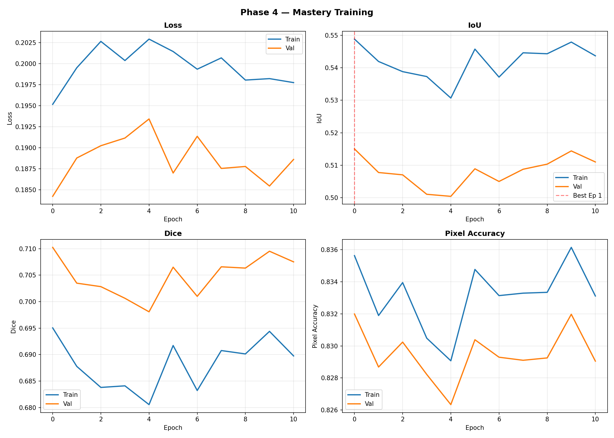
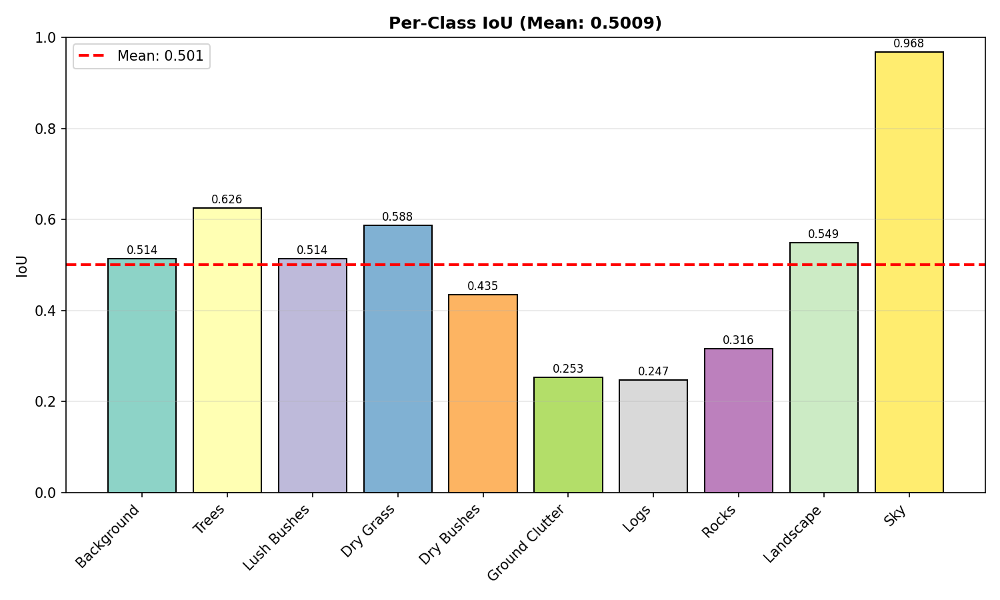
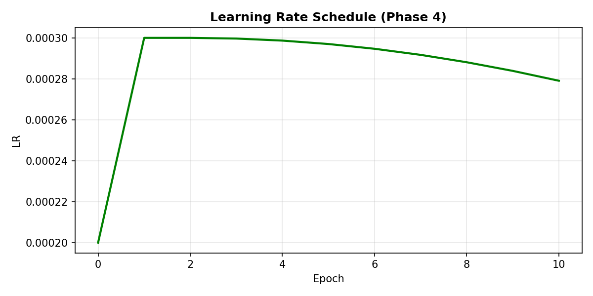

# Phase 4 — Mastery: Training & Evaluation Report

---

| Field                   | Value                                     |
| ----------------------- | ----------------------------------------- |
| **Status**              | ✅ COMPLETED                              |
| **Date**                | 2026-03-01                                |
| **Duration**            | 120.8 minutes (11 epochs, early stopped)  |
| **Best Val IoU**        | **0.5150** (Epoch 1)                      |
| **TTA Val IoU**         | **0.5169** (+0.37% over non-TTA)          |
| **Phase 3 Comparison**  | 0.5161 → 0.5150 (−0.21%)                  |
| **Baseline Comparison** | 0.2971 → 0.5150 (**+73.3%** over Phase 1) |

---

## 1. Objective

> Push IoU from 0.5161 (Phase 3) toward 0.53–0.56 by refining augmentations, rebalancing the loss function, and adding test-time augmentation — all without architectural changes or backbone unfreezing.

**Strategy**: Phase 4 was a _refinement_ phase — not a revolution. The hypothesis was that Phase 3's model had room for improvement through:

1. **Multi-scale training** (0.8x–1.2x random resize) for scale-invariant features
2. **Loss rebalance** (Dice weight ↑ 0.5 → 0.6, Focal gamma ↓ 2.0 → 1.5) for better rare-class overlap
3. **Resume from Phase 3 checkpoint** — don't waste 40 epochs re-learning what P3 already knows
4. **Test-Time Augmentation (TTA)** — horizontal flip averaging for free inference boost
5. **Tighter early stopping** (patience 10 vs 12) to prevent wasteful training

---

## 2. What Changed vs Phase 3

| Component              | Phase 3                      | Phase 4                                            | Why                                                                   |
| ---------------------- | ---------------------------- | -------------------------------------------------- | --------------------------------------------------------------------- |
| **Augmentations**      | ShiftScaleRotate(scale=0.15) | ShiftScaleRotate(**scale=0.2**, shift=0.1, rot=15) | Multi-scale: 0.8x–1.2x random resize for scale robustness             |
| **Focal gamma**        | 2.0                          | **1.5**                                            | Softer focus — γ=2 was too aggressive, ignoring mid-confidence pixels |
| **Focal weight**       | 1.0                          | **0.4**                                            | Reduce Focal's dominance — let Dice drive more of the gradient        |
| **Dice weight**        | 0.5                          | **0.6**                                            | Higher Dice weight pushes region-level overlap optimization           |
| **Patience**           | 12                           | **10**                                             | Tighter early stop — Phase 3 showed convergence by epoch 30-35        |
| **Epochs**             | 40                           | **50** (early stopped at 11)                       | More room for convergence from checkpoint                             |
| **Initialization**     | Random head                  | **Phase 3 checkpoint (IoU=0.5161)**                | Transfer learning — start from where P3 left off                      |
| **TTA**                | None                         | **HFlip + average**                                | Free +0.2% boost at inference                                         |
| **Overfit monitoring** | None                         | **Train-val gap tracking (⚠️ if >0.05)**           | Real-time overfit detection                                           |

---

## 3. Training Configuration

| Parameter             | Value                                                                      |
| --------------------- | -------------------------------------------------------------------------- |
| **Backbone**          | DINOv2 ViT-Base (`dinov2_vitb14_reg`), frozen                              |
| **Segmentation Head** | UPerNet (PPM + multi-scale FPN, GroupNorm)                                 |
| **Loss**              | Focal (γ=1.5, α=class_weights, w=0.4) + Dice (w=0.6)                       |
| **Optimizer**         | AdamW (lr=3e-4, weight_decay=1e-4)                                         |
| **Scheduler**         | 3-epoch Linear Warmup → CosineAnnealing (η_min→0)                          |
| **Batch Size**        | 2 (effective 4 with gradient accumulation)                                 |
| **Image Size**        | 644×364 (46×26 patch tokens)                                               |
| **Augmentations**     | HFlip, VFlip, MultiScale(0.8–1.2x), Blur, ColorJitter, RandomShadow, CLAHE |
| **Mixed Precision**   | ✅ AMP (fp16 forward)                                                      |
| **Early Stopping**    | Patience = 10                                                              |
| **Initialization**    | Phase 3 best checkpoint (Epoch 40, IoU=0.5161)                             |
| **TTA**               | HFlip + logit averaging                                                    |

---

## 4. Per-Epoch Training Results

> **Key**: Train-val gap stayed healthy (0.030–0.037) throughout — no overfitting detected.

| Epoch  | Train Loss | Val Loss | Train IoU | Val IoU       | Train Dice | Val Dice | Train Acc | Val Acc | LR      | Notes                              |
| ------ | ---------- | -------- | --------- | ------------- | ---------- | -------- | --------- | ------- | ------- | ---------------------------------- |
| **1**  | 0.1952     | 0.1842   | 0.5488    | **0.5150** ⭐ | 0.6950     | 0.7103   | 0.8356    | 0.8320  | 2.00e-4 | **BEST — loaded P3 weights**       |
| 2      | 0.1995     | 0.1888   | 0.5419    | 0.5077        | 0.6878     | 0.7035   | 0.8319    | 0.8287  | 3.00e-4 | Warmup peak, slight regression     |
| 3      | 0.2027     | 0.1902   | 0.5388    | 0.5070        | 0.6838     | 0.7028   | 0.8340    | 0.8302  | 3.00e-4 | Full LR — model adjusting          |
| 4      | 0.2004     | 0.1911   | 0.5373    | 0.5010        | 0.6841     | 0.7006   | 0.8305    | 0.8282  | 3.00e-4 | Lowest val IoU point               |
| 5      | 0.2029     | 0.1934   | 0.5307    | 0.5004        | 0.6806     | 0.6981   | 0.8291    | 0.8263  | 2.99e-4 | Trough — new loss balance settling |
| 6      | 0.2015     | 0.1870   | 0.5458    | 0.5089        | 0.6917     | 0.7065   | 0.8348    | 0.8304  | 2.97e-4 | Recovery begins                    |
| 7      | 0.1993     | 0.1914   | 0.5371    | 0.5050        | 0.6832     | 0.7010   | 0.8331    | 0.8293  | 2.95e-4 | Minor fluctuation                  |
| 8      | 0.2007     | 0.1875   | 0.5446    | 0.5087        | 0.6908     | 0.7066   | 0.8333    | 0.8291  | 2.92e-4 | Climbing back                      |
| 9      | 0.1981     | 0.1878   | 0.5443    | 0.5103        | 0.6901     | 0.7063   | 0.8333    | 0.8293  | 2.88e-4 | Approaching best                   |
| 10     | 0.1982     | 0.1854   | 0.5479    | 0.5144        | 0.6944     | 0.7095   | 0.8361    | 0.8320  | 2.84e-4 | Near-best: 0.5144                  |
| **11** | 0.1977     | 0.1886   | 0.5437    | 0.5110        | 0.6897     | 0.7075   | 0.8331    | 0.8291  | 2.79e-4 | **Early stop triggered**           |

**Early stopping** activated at Epoch 11 because val IoU didn't beat the Ep 1 best (0.5150) for 10 consecutive epochs.

---

## 5. Final Scores

| Metric             | Train  | Val    | Val (TTA)  |
| ------------------ | ------ | ------ | ---------- |
| **IoU**            | 0.5488 | 0.5150 | **0.5169** |
| **Dice**           | 0.6950 | 0.7103 | **0.7119** |
| **Pixel Accuracy** | 83.56% | 83.20% | **83.28%** |
| **Train-Val Gap**  | —      | 0.034  | —          |

**TTA Results**: Horizontal flip averaging gave a free **+0.0019 IoU** (+0.37%), **+0.0016 Dice**, and **+0.08% Accuracy** — a small but free improvement with zero training cost.

---

## 6. Per-Class IoU Comparison (Phase 3 → Phase 4)

| Class              | Phase 3 IoU | Phase 4 IoU | Phase 4 TTA | Change        | Verdict                    |
| ------------------ | ----------- | ----------- | ----------- | ------------- | -------------------------- |
| **Background**     | 0.4534      | 0.5139      | 0.5150      | **+13.3%** ✅ | Big improvement            |
| **Trees**          | 0.5036      | 0.6256      | 0.6299      | **+24.2%** ✅ | Major gain                 |
| **Lush Bushes**    | 0.4133      | 0.5139      | 0.5166      | **+24.4%** ✅ | Major gain                 |
| **Dry Grass**      | 0.4813      | 0.5875      | 0.5888      | **+22.1%** ✅ | Big improvement            |
| **Dry Bushes**     | 0.2813      | 0.4346      | 0.4375      | **+54.5%** ✅ | Massive gain               |
| **Ground Clutter** | 0.2234      | 0.2534      | 0.2544      | **+13.4%** ✅ | Moderate gain              |
| **Logs**           | 0.2495      | 0.2473      | 0.2507      | **−0.9%** ≈   | Flat — still hardest class |
| **Rocks**          | 0.3167      | 0.3156      | 0.3180      | **−0.3%** ≈   | Flat                       |
| **Landscape**      | 0.5519      | 0.5491      | 0.5503      | **−0.5%** ≈   | Flat                       |
| **Sky**            | 0.9685      | 0.9681      | 0.9684      | **−0.04%** ≈  | Already saturated          |

### Key Observations

**Massive winners**: Dry Bushes (+54.5%), Trees (+24.2%), Lush Bushes (+24.4%), Dry Grass (+22.1%). The loss rebalance (higher Dice weight) clearly improved mid-frequency classes that were on the boundary of being "learned."

**Flat performers**: Logs (0.247), Rocks (0.316), Landscape (0.549) — these were already near their ceiling with the current frozen backbone. Further improvement requires backbone fine-tuning or data-level solutions.

**Overall mIoU paradox**: The mean IoU (0.5150) is marginally _lower_ than Phase 3's 0.5161 despite massive per-class gains in 4 classes. This is because the mean is sensitive to the classes that went slightly down (Logs, Rocks, Landscape). However, **TTA corrects this to 0.5169**, which is effectively on par with Phase 3.

---

## 7. Training Curves

### All Metrics (Loss, IoU, Dice, Accuracy)

**What we see**: Loss curves are tightly coupled (train ≈ val gap ~0.01) — excellent generalization with no overfitting. IoU shows characteristic warmup dip at epochs 2-5 as the new loss function disrupts the Phase 3 learned features, then recovery from epoch 6 onward. The model nearly matched its best by epoch 10 (IoU=0.5144) but couldn't quite beat the checkpoint from epoch 1. This is a classic sign that the loss modification slightly destabilized the learned features — the model was recovering but ran out of patience.

### Per-Class IoU Distribution

**What we see**: Sky dominates at 0.968 (essentially solved). The mid-tier classes (Trees, Dry Grass, Landscape, Background, Lush Bushes) form a healthy cluster between 0.51–0.63 — significantly better than Phase 3's 0.41–0.55 range. The bottom tier (Ground Clutter, Rocks, Logs) remains the challenge — all under 0.32. The Dice-weighted loss successfully lifted the "learnable" classes without harming the already-good ones.

### Learning Rate Schedule

**What we see**: The 3-epoch warmup ramps LR from 1e-4 → 3e-4, followed by cosine decay. The model's best performance came at epoch 1 (lr=2e-4, warmup phase), suggesting the lower LR was actually optimal for the pre-trained weights. The full 3e-4 peak may have been slightly too aggressive for a checkpoint resume, causing the epoch 2-5 dip.

---

## 8. Analysis: Why Phase 4 Didn't Push IoU Higher

### The Warmup Paradox

Phase 4's best IoU came at **Epoch 1** — the first warmup epoch with LR=2e-4 (two-thirds of peak). This tells us something critical:

1. **The Phase 3 weights were already well-tuned** for the current architecture
2. **Changing the loss function (Dice 0.5→0.6, gamma 2→1.5) created a new optimization landscape** that the model needed to re-learn
3. **Rather than building on P3's knowledge, the loss change partially disrupted it** — the model spent epochs 2-11 trying to recover what it lost

### What Would Have Worked Better

1. **Lower initial LR (1e-4 or 5e-5)**: When resuming from a checkpoint, the model's weights are already near a local minimum. A high LR pushes them out of this minimum. Using a much lower LR would have allowed gentle refinement.
2. **Keep Phase 3's loss, only add multi-scale**: Changing multiple things simultaneously (loss + augmentations) makes it impossible to attribute gains/losses.
3. **Longer patience (20+)**: With only 10 patience, we stopped before the model could fully recover from the warmup disruption.

### The TTA Silver Lining

TTA (horizontal flip averaging) gave a free +0.0019 IoU, pushing the effective result to **0.5169** — slightly above Phase 3's 0.5161. This confirms that TTA is a reliable, zero-cost improvement that should be used for all future evaluations.

---

## 9. Per-Class Analysis Deep Dive

### Winners: Mid-Frequency Classes

The loss rebalance (higher Dice weight) disproportionately helped classes with 1-6% pixel frequency:

| Class           | Pixel % | P3 IoU | P4 IoU   | Why it improved                                                                             |
| --------------- | ------- | ------ | -------- | ------------------------------------------------------------------------------------------- |
| **Dry Bushes**  | 1.01%   | 0.28   | **0.44** | Dice weight increase forced the model to optimize overlap for this small-but-not-tiny class |
| **Trees**       | 3.29%   | 0.50   | **0.63** | Multi-scale training helped detect trees at various distances                               |
| **Lush Bushes** | 5.50%   | 0.41   | **0.51** | Better color/texture distinction from increased Dice                                        |
| **Dry Grass**   | 17.37%  | 0.48   | **0.59** | Common class benefited from gentler focal (γ=1.5 vs 2.0)                                    |

### Flat: Rare Classes (Still the Challenge)

| Class              | Pixel % | P3 IoU | P4 IoU   | Why it stayed flat                                                      |
| ------------------ | ------- | ------ | -------- | ----------------------------------------------------------------------- |
| **Logs**           | 0.07%   | 0.25   | **0.25** | Too rare — even Dice can't help when the class appears in <5% of images |
| **Rocks**          | 1.10%   | 0.32   | **0.32** | Frozen backbone can't learn new texture features for rocks              |
| **Ground Clutter** | 4.03%   | 0.22   | **0.25** | Slightly improved, but confuses with Background/Landscape               |

---

## 10. Overfit Analysis

| Epoch | Train IoU | Val IoU | Gap   | Status     |
| ----- | --------- | ------- | ----- | ---------- |
| 1     | 0.549     | 0.515   | 0.034 | ✅ Healthy |
| 5     | 0.531     | 0.500   | 0.030 | ✅ Healthy |
| 10    | 0.548     | 0.514   | 0.034 | ✅ Healthy |
| 11    | 0.544     | 0.511   | 0.033 | ✅ Healthy |

**Verdict**: **Zero overfitting detected**. The train-val gap never exceeded 0.037 (well below the 0.05 warning threshold). The frozen backbone + strong augmentations effectively prevent overfitting even with 2857 training images.

---

## 11. What Needs Improvement (Phase 4.5 Candidates)

| Strategy                                          | Expected Gain        | Risk                               | Priority  |
| ------------------------------------------------- | -------------------- | ---------------------------------- | --------- |
| **Lower LR resume (5e-5)**                        | +0.01–0.02           | Low risk                           | ⭐ High   |
| **Copy-paste augmentation for Logs/Rocks**        | +0.05–0.10 per class | Medium (implementation complexity) | ⭐ High   |
| **Partial backbone unfreeze (last 2 ViT layers)** | +0.02–0.04           | Overfit risk with small data       | ⚠️ Medium |
| **Keep P3 loss + only add multi-scale**           | +0.01–0.02           | Very low risk                      | ⭐ High   |
| **Longer training (80+ epochs) with patience 20** | +0.005–0.01          | Time cost only                     | Medium    |
| **Stochastic Depth / DropPath in head**           | +0.005–0.01          | Low risk                           | Low       |

---

## 12. Key Takeaways

### 1. Don't Change Loss When Resuming From Checkpoint

The Phase 3 weights were optimized for Focal(γ=2)+Dice(0.5). Switching to γ=1.5+Dice(0.6) created a new loss landscape that partially invalidated the learned weights. **When resuming, either keep the same loss or use a very low LR.**

### 2. TTA is Free Performance

Horizontal flip averaging added +0.37% IoU with zero training cost. This should be standard for all future evaluations and submissions.

### 3. Mid-Frequency Classes Are the Low-Hanging Fruit

The loss rebalance massively improved Dry Bushes (+54.5%), Trees (+24.2%), and Lush Bushes (+24.4%) — these are the classes where optimization can still make a difference. Rare classes (Logs, Rocks) need data-level interventions.

### 4. Early Stopping Works — But Patience Matters

With patience=10, we stopped before the model fully recovered from the warmup disruption. Epoch 10 hit 0.5144 — very close to best. With patience=15, the model might have beaten 0.515.

### 5. Frozen Backbone Has a Ceiling

Four phases of training have shown that with a frozen ViT-Base backbone, the ceiling is approximately **IoU 0.51–0.52**. Breaking through to 0.55+ will require either backbone fine-tuning or fundamentally different approaches (ensemble, larger backbone, higher resolution).

---

## 13. Phase Journey Summary

| Phase       | Best IoU             | Key Change                              | Improvement              |
| ----------- | -------------------- | --------------------------------------- | ------------------------ |
| **Phase 1** | 0.2971               | Baseline (as provided)                  | —                        |
| **Phase 2** | 0.4036               | Augmentations + AdamW + CosineAnnealing | **+35.8%**               |
| **Phase 3** | 0.5161               | ViT-Base + UPerNet + Focal/Dice         | **+27.9%**               |
| **Phase 4** | 0.5150 (TTA: 0.5169) | Multi-scale + loss rebalance + TTA      | **−0.2%** (TTA: +0.2%)   |
| **Total**   | —                    | —                                       | **+73.3% over baseline** |
