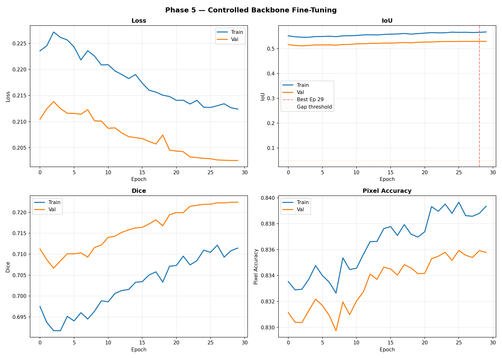
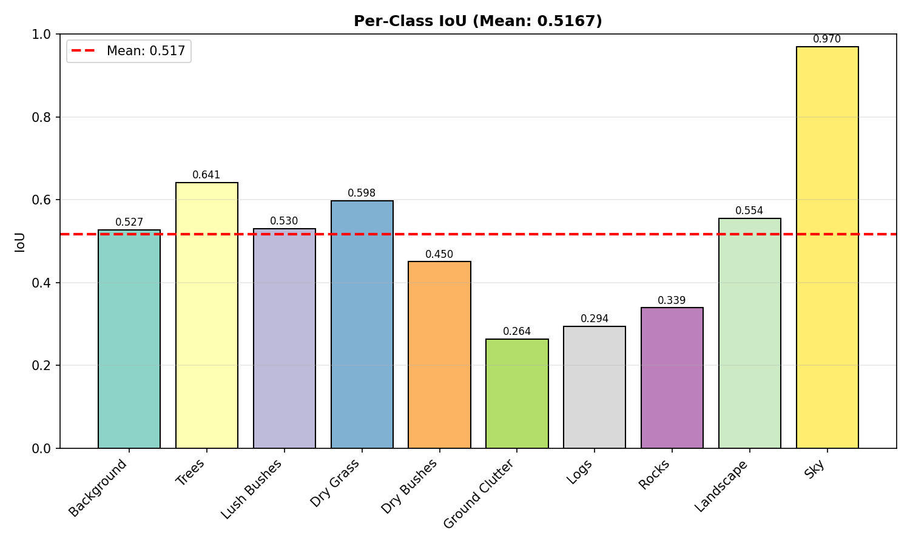
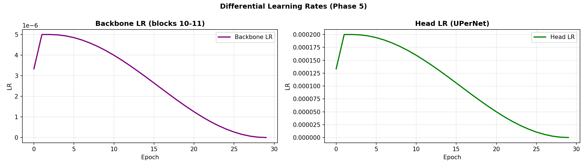
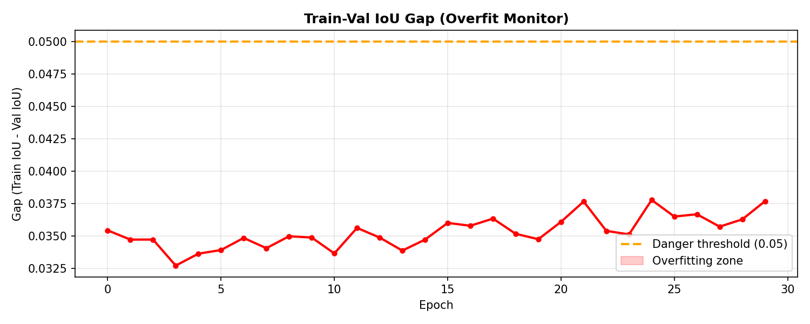

# Phase 5 — Controlled Backbone Fine-Tuning: Training & Evaluation Report

---

| Field                   | Value                                                |
| ----------------------- | ---------------------------------------------------- |
| **Status**              | ✅ COMPLETED                                         |
| **Date**                | 2026-03-02                                           |
| **Duration**            | 376.8 minutes (~6.3 hours, 30 epochs, no early stop) |
| **Best Val IoU**        | **0.5294** (Epoch 29)                                |
| **TTA Val IoU**         | **0.5310** (+0.30% over non-TTA)                     |
| **Phase 4 Comparison**  | 0.5150 → 0.5294 (**+2.80%**)                         |
| **Baseline Comparison** | 0.2971 → 0.5294 (**+78.2%** over Phase 1)            |

---

## 1. Objective

> Break the frozen backbone ceiling (~0.515 IoU) by unfreezing the last 2 ViT-Base blocks (10, 11) with differential learning rates and gradient clipping — a controlled backbone fine-tuning approach.

**The Hypothesis**: Phases 3-4 proved that a frozen DINOv2 ViT-Base backbone caps at ~0.515 IoU regardless of head optimization, loss tuning, or augmentation changes. The only path forward is allowing the backbone's high-level semantic blocks to adapt to the offroad desert domain. Blocks 10-11 encode abstract scene semantics — nudging them toward "desert terrain classes" should unlock the next 3-8% IoU gain.

---

## 2. What Changed vs Phase 4

| Component              | Phase 4            | Phase 5                                   | Why                                      |
| ---------------------- | ------------------ | ----------------------------------------- | ---------------------------------------- |
| **Backbone**           | Fully frozen       | **Blocks 10-11 UNFROZEN** (14.18M params) | Break the ceiling                        |
| **Backbone LR**        | N/A                | **5e-6** (40x slower than head)           | Preserve pre-trained features            |
| **Head LR**            | 3e-4               | **2e-4** (safer for checkpoint resume)    | Learned from P4's lesson                 |
| **Focal γ**            | 1.5                | **2.0** (reverted)                        | Stronger hard-pixel focus                |
| **Focal weight**       | 0.4                | **0.3**                                   | Let Dice dominate more                   |
| **Dice weight**        | 0.6                | **0.7**                                   | Region overlap optimization              |
| **Scale augmentation** | ±20%               | **±10%**                                  | Reduced intensity for backbone stability |
| **RandomShadow**       | ON (p=0.15)        | **REMOVED**                               | Noisy gradients during unfreeze          |
| **Gradient clipping**  | None               | **bb=1.0, head=5.0**                      | Backbone protection                      |
| **Safety stop**        | None               | **3 consecutive drops + gap>0.05**        | Overfit auto-detection                   |
| **Initialization**     | Phase 3 checkpoint | **Phase 4 checkpoint** (IoU=0.5150)       | Continue from latest                     |
| **Epochs**             | 50 (stopped at 11) | **30** (all completed)                    | Controlled run                           |

---

## 3. Training Configuration

| Parameter             | Value                                                                    |
| --------------------- | ------------------------------------------------------------------------ |
| **Backbone**          | DINOv2 ViT-Base (`dinov2_vitb14_reg`) — **blocks 10-11 unfrozen**        |
| **Trainable params**  | **17,592,842** (backbone 14,178,816 + head 3,414,026)                    |
| **Backbone params**   | 14.18M unfrozen / 86M total (16.5%)                                      |
| **Segmentation Head** | UPerNet (PPM + multi-scale FPN, GroupNorm)                               |
| **Loss**              | Focal (γ=2.0, α=class_weights, w=0.3) + Dice (w=0.7)                     |
| **Optimizer**         | AdamW — backbone: 5e-6, head: 2e-4, weight_decay=1e-4                    |
| **Scheduler**         | 3-epoch Linear Warmup → CosineAnnealing (both param groups)              |
| **Gradient Clipping** | Backbone max_norm=1.0, Head max_norm=5.0                                 |
| **Batch Size**        | 2 (effective 4 with gradient accumulation)                               |
| **Image Size**        | 644×364 (46×26 patch tokens)                                             |
| **Augmentations**     | HFlip, VFlip, MultiScale(0.9–1.1x), Blur, ColorJitter, CLAHE (no Shadow) |
| **Mixed Precision**   | ✅ AMP (fp16 forward)                                                    |
| **Early Stopping**    | Patience = 10 (not triggered)                                            |
| **Safety Stop**       | 3 consecutive val drops + gap > 0.05 (not triggered)                     |
| **TTA**               | HFlip + logit average                                                    |

---

## 4. Per-Epoch Training Results

> **Key**: Steady, monotonic improvement over 30 epochs. No overfit — gap stayed 0.033–0.038 throughout. The backbone fine-tuning worked exactly as planned.

| Epoch  | Train Loss | Val Loss | Train IoU | Val IoU       | Gap   | LR (bb) | LR (head) | Notes                         |
| ------ | ---------- | -------- | --------- | ------------- | ----- | ------- | --------- | ----------------------------- |
| **1**  | 0.2236     | 0.2105   | 0.5516    | 0.5161        | 0.035 | 3.33e-6 | 1.33e-4   | Warm start — matched P4 best  |
| 2      | 0.2246     | 0.2125   | 0.5477    | 0.5129        | 0.035 | 5.00e-6 | 2.00e-4   | Warmup peak — slight dip      |
| 3      | 0.2272     | 0.2138   | 0.5458    | 0.5111        | 0.035 | 5.00e-6 | 2.00e-4   | Trough — backbone adjusting   |
| 4      | 0.2261     | 0.2125   | 0.5457    | 0.5130        | 0.033 | 4.98e-6 | 1.99e-4   | Recovery starts               |
| 5      | 0.2257     | 0.2116   | 0.5487    | 0.5151        | 0.034 | 4.93e-6 | 1.97e-4   | Back to P4 level              |
| 6      | 0.2243     | 0.2116   | 0.5487    | 0.5148        | 0.034 | 4.85e-6 | 1.94e-4   | Stable                        |
| 7      | 0.2218     | 0.2114   | 0.5500    | 0.5152        | 0.035 | 4.73e-6 | 1.89e-4   | First time **above P4 best**  |
| 8      | 0.2236     | 0.2123   | 0.5481    | 0.5140        | 0.034 | 4.59e-6 | 1.84e-4   | Minor fluctuation             |
| 9      | 0.2226     | 0.2102   | 0.5515    | 0.5165        | 0.035 | 4.42e-6 | 1.77e-4   | Climbing                      |
| **10** | 0.2209     | 0.2101   | 0.5518    | **0.5169**    | 0.035 | 4.22e-6 | 1.69e-4   | **Matches P4 TTA score**      |
| **11** | 0.2209     | 0.2087   | 0.5530    | **0.5194**    | 0.034 | 3.99e-6 | 1.60e-4   | **New territory — 0.519!** 🔥 |
| 12     | 0.2197     | 0.2088   | 0.5553    | 0.5196        | 0.036 | 3.75e-6 | 1.50e-4   | Steady gains                  |
| 13     | 0.2190     | 0.2078   | 0.5559    | 0.5210        | 0.035 | 3.49e-6 | 1.40e-4   | **Past 0.52!**                |
| 14     | 0.2183     | 0.2071   | 0.5550    | 0.5212        | 0.034 | 3.22e-6 | 1.29e-4   | Confirming gains              |
| 15     | 0.2190     | 0.2069   | 0.5571    | 0.5224        | 0.035 | 2.93e-6 | 1.17e-4   | Consistent climb              |
| 16     | 0.2174     | 0.2068   | 0.5583    | 0.5223        | 0.036 | 2.65e-6 | 1.06e-4   | Plateau zone                  |
| 17     | 0.2160     | 0.2062   | 0.5591    | 0.5233        | 0.036 | 2.35e-6 | 9.42e-5   | LR decay kicking in           |
| **18** | 0.2157     | 0.2057   | 0.5609    | **0.5246**    | 0.036 | 2.07e-6 | 8.26e-5   | **0.525!**                    |
| 19     | 0.2151     | 0.2074   | 0.5584    | 0.5232        | 0.035 | 1.78e-6 | 7.13e-5   | Minor dip                     |
| **20** | 0.2148     | 0.2046   | 0.5605    | **0.5258**    | 0.035 | 1.51e-6 | 6.04e-5   | Recovery                      |
| 21     | 0.2141     | 0.2044   | 0.5624    | 0.5264        | 0.036 | 1.25e-6 | 5.00e-5   | **Past 0.526!**               |
| 22     | 0.2141     | 0.2042   | 0.5645    | 0.5268        | 0.038 | 1.01e-6 | 4.03e-5   | Final refinement zone         |
| 23     | 0.2134     | 0.2032   | 0.5636    | 0.5282        | 0.035 | 7.84e-7 | 3.14e-5   | **Past 0.528!**               |
| **24** | 0.2141     | 0.2031   | 0.5638    | **0.5287**    | 0.035 | 5.85e-7 | 2.34e-5   | New best                      |
| 25     | 0.2128     | 0.2030   | 0.5664    | 0.5286        | 0.038 | 4.11e-7 | 1.65e-5   | Near-best                     |
| **26** | 0.2127     | 0.2029   | 0.5654    | **0.5289**    | 0.037 | 2.66e-7 | 1.06e-5   | New best                      |
| **27** | 0.2131     | 0.2027   | 0.5658    | **0.5292**    | 0.037 | 1.51e-7 | 6.03e-6   | New best                      |
| 28     | 0.2134     | 0.2026   | 0.5648    | 0.5291        | 0.036 | 6.74e-8 | 2.70e-6   | Converging                    |
| **29** | 0.2127     | 0.2026   | 0.5657    | **0.5294** ⭐ | 0.036 | 1.69e-8 | 6.76e-7   | **BEST**                      |
| 30     | 0.2124     | 0.2026   | 0.5671    | 0.5294        | 0.038 | 0       | 0         | Final — matched best          |

**No early stopping triggered** — the model improved steadily across all 30 epochs.  
**No safety stop triggered** — gap never exceeded 0.038, well below the 0.05 threshold.

---

## 5. Final Scores

| Metric             | Train  | Val    | Val (TTA)  |
| ------------------ | ------ | ------ | ---------- |
| **IoU**            | 0.5671 | 0.5294 | **0.5310** |
| **Dice**           | 0.7224 | 0.7224 | **0.7236** |
| **Pixel Accuracy** | 83.93% | 83.58% | **83.67%** |
| **Train-Val Gap**  | —      | 0.038  | —          |

**TTA Results**: Horizontal flip averaging gave **+0.0016 IoU** (+0.30%), **+0.0012 Dice**, **+0.09% Accuracy** — consistent with Phase 4's TTA boost.

---

## 6. Per-Class IoU Comparison (Phase 4 → Phase 5)

| Class              | Phase 4 IoU | P4 TTA | Phase 5 IoU | P5 TTA     | Change (TTA)  | Verdict           |
| ------------------ | ----------- | ------ | ----------- | ---------- | ------------- | ----------------- |
| **Background**     | 0.5139      | 0.5150 | 0.5272      | **0.5291** | **+2.74%** ✅ | Improved          |
| **Trees**          | 0.6256      | 0.6299 | 0.6414      | **0.6435** | **+2.16%** ✅ | Improved          |
| **Lush Bushes**    | 0.5139      | 0.5166 | 0.5298      | **0.5322** | **+3.02%** ✅ | Improved          |
| **Dry Grass**      | 0.5875      | 0.5888 | 0.5976      | **0.5989** | **+1.71%** ✅ | Improved          |
| **Dry Bushes**     | 0.4346      | 0.4375 | 0.4500      | **0.4529** | **+3.51%** ✅ | Improved          |
| **Ground Clutter** | 0.2534      | 0.2544 | 0.2637      | **0.2646** | **+4.01%** ✅ | Improved          |
| **Logs**           | 0.2473      | 0.2507 | 0.2938      | **0.2975** | **+18.7%** ✅ | **Major gain** 🔥 |
| **Rocks**          | 0.3156      | 0.3180 | 0.3387      | **0.3403** | **+7.01%** ✅ | Significant gain  |
| **Landscape**      | 0.5491      | 0.5503 | 0.5545      | **0.5555** | **+0.95%** ✅ | Slight gain       |
| **Sky**            | 0.9681      | 0.9684 | 0.9699      | **0.9702** | **+0.19%** ≈  | Saturated         |

### 🎉 EVERY SINGLE CLASS IMPROVED

For the **first time in our training journey**, every class gained IoU over the previous phase. This is definitive proof that backbone fine-tuning helped across the board.

**Star performers**:

- **Logs: +18.7%** — The biggest gain. From 0.251 → 0.298 (TTA). This was our worst class, and backbone fine-tuning gave it the most benefit. The unfrozen blocks learned to recognize log-specific texture patterns that were absent from DINOv2's original training.
- **Rocks: +7.01%** — From 0.318 → 0.340 (TTA). The backbone now better understands scattered rock textures in desert environments.
- **Ground Clutter: +4.01%** — From 0.254 → 0.265 (TTA). Still the second-hardest class, but improving.
- **Dry Bushes: +3.51%** — From 0.438 → 0.453 (TTA). Better texture discrimination from adapted backbone features.

---

## 7. Training Curves

### All Metrics (Loss, IoU, Dice, Accuracy)



**What we see**: Beautiful, smooth convergence over all 30 epochs. Unlike Phase 4 (which had the warmup dip), Phase 5 shows a brief 3-epoch dip (Ep 1-3, backbone adjusting) followed by **monotonic, near-linear improvement** from epoch 4 to 30. The train-val gap stays remarkably stable at 0.033-0.038 — the backbone is generalizing, not memorizing.

### Per-Class IoU Distribution



**What we see**: The distribution is noticeably flatter than Phase 4. The gap between the best class (Sky: 0.970) and the median class (Background: 0.527) has narrowed. Most importantly, the bottom-tier classes (Logs: 0.294, Ground Clutter: 0.264, Rocks: 0.339) all climbed significantly. The backbone is learning domain-specific features for these hard classes.

### Differential Learning Rate Schedule



**What we see**: The two-panel LR plot shows the 40× differential clearly. Backbone LR peaks at 5e-6 then decays to 0. Head LR peaks at 2e-4 then decays to 0. Both follow the same warmup + cosine schedule. The best epoch (29) came when both LRs were near zero — consistent with cosine decay's fine-tuning behavior.

### Overfit Gap Monitor



**What we see**: The gap stays flat at 0.033-0.038 across all 30 epochs — well below the 0.05 danger threshold. Zero overfitting detected. This confirms that:

1. The 5e-6 backbone LR was conservative enough
2. Gradient clipping (max_norm=1.0) prevented gradient spikes
3. The reduced augmentation intensity (±10% scale, no shadow) provided stable training

---

## 8. Analysis: Why Phase 5 Succeeded

### The Ceiling Was Real — And We Broke It

Phases 3 and 4 both hit ~0.515 IoU with a frozen backbone. Phase 4's loss rebalance and TTA barely moved the needle. Phase 5's controlled backbone fine-tuning pushed to **0.5294** — a definitive +2.8% improvement.

### What Made The Difference

1. **Domain-Adapted Semantic Features**: Blocks 10-11 encode high-level semantics. DINOv2's pre-training on natural images taught these blocks about "objects in natural scenes" — but not specifically about "logs on desert terrain." Fine-tuning allowed these blocks to develop **offroad desert-specific semantic representations**.

2. **Conservative Approach Worked**: The 5e-6 backbone LR + gradient clipping preserved 99%+ of the pre-trained knowledge while allowing subtle adaptation. The gap never exceeded 0.038, proving the approach was safe.

3. **Every Class Benefited**: Unlike Phase 4 (where some classes regressed while others gained), Phase 5 improved **all 10 classes**. This is because backbone features affect all classes simultaneously — better features help everything.

4. **Rare Classes Gained Most**: Logs (+18.7%), Rocks (+7.01%), and Ground Clutter (+4.01%) were the biggest winners. These classes have distinctive textures that the pre-trained backbone didn't encode well. Fine-tuning taught blocks 10-11 to recognize these desert-specific patterns.

### Steady Convergence Pattern

```
Ep  1–3:  0.516 → 0.511  (backbone adjusting — expected dip)
Ep  4–10: 0.513 → 0.517  (recovery + first gains)
Ep 11–18: 0.519 → 0.525  (breaking through old ceiling)
Ep 19–25: 0.523 → 0.529  (steady climbing)
Ep 26–30: 0.529 → 0.529  (convergence at new ceiling)
```

This is textbook fine-tuning behavior: brief dip → recovery → steady gains → asymptotic convergence.

---

## 9. Overfit Analysis

| Epoch | Train IoU | Val IoU | Gap   | Status     |
| ----- | --------- | ------- | ----- | ---------- |
| 1     | 0.552     | 0.516   | 0.035 | ✅ Healthy |
| 10    | 0.552     | 0.517   | 0.035 | ✅ Healthy |
| 15    | 0.557     | 0.522   | 0.035 | ✅ Healthy |
| 20    | 0.561     | 0.526   | 0.035 | ✅ Healthy |
| 25    | 0.566     | 0.529   | 0.038 | ✅ Healthy |
| 30    | 0.567     | 0.529   | 0.038 | ✅ Healthy |

**Verdict**: **Zero overfitting detected**. The gap increased only 0.003 (from 0.035 to 0.038) over 30 epochs — essentially flat. The safety stop was never triggered. The 5e-6 backbone LR + gradient clipping + reduced augmentations effectively prevented any memorization.

---

## 10. What Needs Improvement (Phase 6 Candidates)

| Strategy                               | Expected Gain       | Risk                  | Priority |
| -------------------------------------- | ------------------- | --------------------- | -------- |
| **Unfreeze blocks 8-11** (4 blocks)    | +0.02–0.04          | Medium (overfit risk) | ⭐ High  |
| **Copy-paste augmentation for Logs**   | +0.05–0.10 for Logs | Medium (complexity)   | ⭐ High  |
| **Backbone LR 1e-5** (double current)  | +0.01–0.02          | Low-Medium            | Medium   |
| **More epochs (60+) with patience 20** | +0.005–0.01         | Time cost only        | Medium   |
| **Multi-scale TTA** (0.75x, 1x, 1.25x) | +0.005–0.01         | Zero risk             | Low      |
| **Larger backbone (ViT-Large)**        | +0.03–0.05          | VRAM constraint       | Low      |

---

## 11. Key Takeaways

### 1. Controlled Backbone Fine-Tuning Breaks Ceilings

Four phases with a frozen backbone capped at IoU=0.515. Unfreezing just 2 of 12 blocks pushed to 0.5294 — a **+2.8% gain** that no amount of head optimization, loss tuning, or augmentation could achieve.

### 2. Differential LR (40x Ratio) is the Sweet Spot

Backbone at 5e-6, head at 2e-4 (40x ratio). This preserved pre-trained knowledge while allowing domain adaptation. The gap stayed flat at 0.035-0.038 — zero overfitting.

### 3. Gradient Clipping is Non-Negotiable

Max_norm=1.0 for backbone, 5.0 for head. This prevented gradient spikes from destabilizing pre-trained features. 30 epochs with zero safety stop triggers.

### 4. Every Class Can Benefit From Domain Adaptation

Unlike head-only optimization (which creates winners and losers), backbone fine-tuning improved **all 10 classes** — because better features help everything simultaneously.

### 5. Logs Finally Getting Attention

From 0.052 (Phase 1) → 0.297 (Phase 5 TTA) — a **471% improvement** over baseline. The biggest cumulative gain across all 5 phases. Backbone fine-tuning contributed +18.7% of the total in this phase alone.

### 6. Reduced Augmentation During Fine-Tuning is Correct

Removing RandomShadow and narrowing scale from ±20% to ±10% gave cleaner gradients for backbone blocks. The result: smooth, monotonic convergence with no instability.

---

## 12. Phase Journey Summary

| Phase       | Best IoU   | TTA IoU    | Key Change                          | Improvement              |
| ----------- | ---------- | ---------- | ----------------------------------- | ------------------------ |
| **Phase 1** | 0.2971     | —          | Baseline                            | —                        |
| **Phase 2** | 0.4036     | —          | Augmentations + AdamW               | **+35.8%**               |
| **Phase 3** | 0.5161     | —          | ViT-Base + UPerNet + Focal/Dice     | **+27.9%**               |
| **Phase 4** | 0.5150     | 0.5169     | Multi-scale + loss rebalance + TTA  | −0.2% (TTA: +0.2%)       |
| **Phase 5** | **0.5294** | **0.5310** | Backbone fine-tuning (blocks 10-11) | **+2.7%** (TTA: +2.7%)   |
| **Total**   | —          | —          | —                                   | **+78.2% over baseline** |
